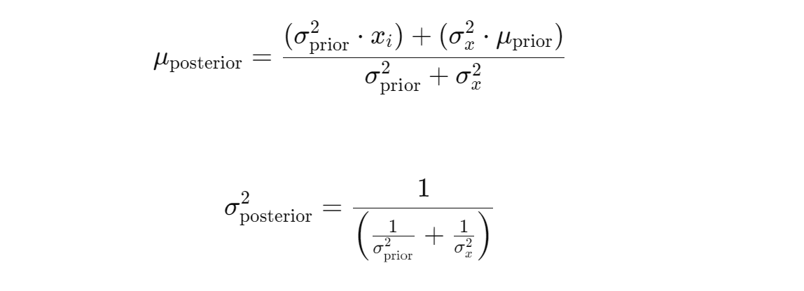

# AlphaQuantTrader

Welcome to the AlphaQuantTrader project! This powerful trading bot is designed to revolutionize the way you approach algorithmic trading by leveraging advanced machine learning techniques and Bayesian statistics.

## 1) What Exactly is AlphaQuantTrader?
AlphaQuantTrader is a sophisticated trading bot that utilizes reinforcement learning to automate and optimize stock trading decisions. It operates within a custom-built trading environment that simulates real-world market conditions, allowing the bot to make informed buy, hold, or sell decisions based on historical financial data. The bot is powered by a deep Q-network (DQN) model, which learns to maximize portfolio returns by continuously adapting to changing market conditions.

Additionally, AlphaQuantTrader incorporates Bayesian statistical methods to dynamically adjust risk and enhance decision-making, ensuring robust performance even in volatile markets.

## 2) Key Features

**2.1) Custom Trading Environment:**
AlphaQuantTrader is built on a custom Gym environment that accurately simulates trading activities, including transaction costs and portfolio management, offering a realistic trading experience.

**2.2) Deep Q-Network (DQN):**
At its core, the bot uses a DQN model to predict and execute the most profitable trading actions, learning from past market data to improve its strategies over time.

**2.3) Bayesian Risk Management:**
The bot integrates Bayesian updating techniques to adjust its risk management strategies dynamically, taking into account market volatility and uncertainty.

**2.4) Historical Data Processing:**
AlphaQuantTrader preprocesses and utilizes historical market data, including adjusted closing prices, daily returns, and volatility, to inform its trading decisions.

**2.5) Portfolio Optimization:**
Through reinforcement learning, the bot continuously seeks to optimize its portfolio by balancing risk and reward, aiming to maximize long-term gains.

## 3) Why Use AlphaQuantTrader?

AlphaQuantTrader is ideal for traders and developers looking to automate and enhance their trading strategies with cutting-edge AI. Whether you're aiming to reduce the manual effort in trading or seeking a robust system that adapts to market changes, AlphaQuantTrader provides the tools and intelligence to help you stay ahead in the financial markets. With its combination of deep learning and Bayesian techniques, AlphaQuantTrader offers a strategic edge that goes beyond traditional trading algorithms.

# 4) Model Overview

Let's start by importimg the necessary libraries

```python
import yfinance as yf
import pandas as pd
import numpy as np
import matplotlib.pyplot as plt
from scipy.stats import norm
import gym
from gym import spaces
import random
from collections import deque, namedtuple
import tensorflow as tf
from tensorflow.keras.models import Sequential
from tensorflow.keras.layers import Dense
from tensorflow.keras.layers import Dense, Conv1D, MaxPooling1D, Flatten, LSTM, TimeDistributed, Input, Bidirectional
from tensorflow.keras.optimizers import Adam
from tensorflow.keras.regularizers import l2
from tensorflow.keras.models import load_model
from sklearn.preprocessing import StandardScaler
import joblib
```
## 5) Preprocessing

The preprocessing phase is crucial for preparing raw financial data into a form suitable for training the reinforcement learning model. This step involves acquiring historical market data, cleaning it, and engineering the necessary features to ensure that the model receives meaningful input for effective learning.

**5.1) Data Acquisition**

Historical stock price data for the National Stock Exchange of India (^NSEI) index is downloaded using the `yfinance` library. The dataset spans a 10-year period, from January 1, 2014, to July 31, 2024, and provides the foundation for training and testing the reinforcement learning model.

```python
data = yf.download('^NSEI', start='2014-01-01', end='2024-07-31', interval='1d')
```
Here's a glimpse of the data we're working with. The first 10 rows of the data are as follows:
```
| Date       | Open         | High         | Low          | Close        | Adj Close   | Volume |
|------------|--------------|--------------|--------------|--------------|-------------|--------|
| 02-01-2014 | 6301.25      | 6358.299805  | 6211.299805  | 6221.149902  | 6221.149902 | 158100 |
| 03-01-2014 | 6194.549805  | 6221.700195  | 6171.25      | 6211.149902  | 6211.149902 | 139000 |
| 06-01-2014 | 6220.850098  | 6224.700195  | 6170.25      | 6191.450195  | 6191.450195 | 118300 |
| 07-01-2014 | 6203.899902  | 6221.5       | 6144.75      | 6162.25      | 6162.25     | 138600 |
| 08-01-2014 | 6178.049805  | 6192.100098  | 6160.350098  | 6174.600098  | 6174.600098 | 146900 |
| 09-01-2014 | 6181.700195  | 6188.049805  | 6148.25      | 6168.350098  | 6168.350098 | 150100 |
| 10-01-2014 | 6178.850098  | 6239.100098  | 6139.600098  | 6171.450195  | 6171.450195 | 159900 |
| 13-01-2014 | 6189.549805  | 6288.200195  | 6189.549805  | 6272.75      | 6272.75     | 135000 |
| 14-01-2014 | 6260.25      | 6280.350098  | 6234.149902  | 6241.850098  | 6241.850098 | 110200 |
| 15-01-2014 | 6265.950195  | 6325.200195  | 6265.299805  | 6320.899902  | 6320.899902 | 145900 |
```
And the last 10 rows of the data are as follows:

```
| Date       | Open         | High         | Low          | Close        | Adj Close   | Volume |
|------------|--------------|--------------|--------------|--------------|-------------|--------|
| 16-07-2024 | 24615.90039  | 24661.25     | 24587.65039  | 24613        | 24613       | 283200 |
| 18-07-2024 | 24543.80078  | 24837.75     | 24504.44922  | 24800.84961  | 24800.84961 | 350900 |
| 19-07-2024 | 24853.80078  | 24854.80078  | 24508.15039  | 24530.90039  | 24530.90039 | 343800 |
| 22-07-2024 | 24445.75     | 24595.19922  | 24362.30078  | 24509.25     | 24509.25    | 324200 |
| 23-07-2024 | 24568.90039  | 24582.55078  | 24074.19922  | 24479.05078  | 24479.05078 | 436400 |
| 24-07-2024 | 24444.94922  | 24504.25     | 24307.25     | 24413.5      | 24413.5     | 366600 |
| 25-07-2024 | 24230.94922  | 24426.15039  | 24210.80078  | 24406.09961  | 24406.09961 | 391800 |
| 26-07-2024 | 24423.34961  | 24861.15039  | 24410.90039  | 24834.84961  | 24834.84961 | 383800 |
| 29-07-2024 | 24943.30078  | 24999.75     | 24774.59961  | 24836.09961  | 24836.09961 | 355000 |
| 30-07-2024 | 24839.40039  | 24971.75     | 24798.65039  | 24857.30078  | 24857.30078 | 385000 |
```

**Split the data based on the date**

```python
split_date = '2022-01-01'
training_data = data[data.index < split_date].copy()
test_data = data[data.index >= split_date].copy()
```
This code segment divides the dataset into training and testing sets. Specifically, data from January 1, 2014, to December 31, 2021, is used as the training data to build and train the model. The remaining data, from January 1, 2022, to July 31, 2024, is reserved as test data to evaluate the model's performance on more recent, unseen data.

**Calculate daily returns on the training data**

```python
training_data['Daily Returns'] = training_data['Close'].pct_change()
```
To prepare the data for further analysis, daily returns are calculated on the training dataset. This is done by taking the percentage change in the closing prices, which helps in understanding the daily price movements.

```python
training_data_cleaned = training_data[['Adj Close', 'Daily Returns']].copy()
```
 The training data is then cleaned to retain only the adjusted closing prices and the newly calculated daily returns. These will be essential for the upcoming model calculations and derivations.

 **Volatility and Dynamic Window Size Calculation**

In this phase of the project, the aim is to calculate market volatility and adjust the analysis window size dynamically based on this volatility. These steps are crucial for capturing the changing market dynamics more accurately. To better understand market conditions, it's important to calculate how much prices fluctuate over time (volatility) and adjust the analysis window size accordingly. Below is the code that handles these calculations:

```python
def calculate_fixed_window_volatility(data, window_size=20):
    """Calculate rolling volatility with a fixed window size."""
    return data.rolling(window=window_size).std()

def determine_dynamic_window_size(volatility, min_window=5, max_window=20):
    """Determine dynamic window size based on volatility."""
    inverse_volatility = 1 / volatility.replace(0, np.nan)  # Handle zero volatility
    normalized_window_size = (inverse_volatility - inverse_volatility.min()) / (inverse_volatility.max() - inverse_volatility.min())
    dynamic_window_size = normalized_window_size * (max_window - min_window) + min_window
    return dynamic_window_size.fillna(min_window).astype(int)  # Fill NaNs and cast to int

training_data_cleaned['volatility'] = calculate_fixed_window_volatility(training_data_cleaned['Daily Returns'])

training_data_cleaned['dynamic_window_sizes'] = determine_dynamic_window_size(training_data_cleaned['volatility'])
```
This code block begins by calculating the rolling volatility of daily returns using the `calculate_fixed_window_volatility` function. The function takes the daily returns from training_data_cleaned and calculates how volatile the market has been over the last 20 days, storing the results in the volatility column.

Next, the `determine_dynamic_window_size` function adjusts the window size dynamically based on the calculated volatility. This adjustment ensures that when the market is more volatile, the analysis focuses on more recent data by using a smaller window size. The dynamically adjusted window sizes are then stored in the `dynamic_window_sizes` column of the training_data_cleaned DataFrame.

These calculations are crucial for ensuring that the model remains sensitive to market conditions, allowing it to adapt to changes in volatility over time.

**Autocorrelation Function (ACF) and Partial Autocorrelation Function (PACF)**

In this project, a fixed window size of 20 was chosen for calculating rolling volatility. This decision was informed by analyzing the Autocorrelation Function (ACF) and Partial Autocorrelation Function (PACF) plots of the volatility data.


The ACF plot shows the correlation between the volatility and its lagged values, while the PACF plot helps in understanding the direct relationship between volatility and its lags, excluding the influence of intermediate lags.

Upon examining these plots, it was observed that the significant correlations and patterns start to diminish around the 20th lag. This indicates that a 20-day window effectively captures the relevant historical volatility, making it a suitable choice for the fixed window size in this context.

This selection ensures that the model accounts for the most impactful recent volatility trends, without incorporating too much noise from older data.

**5.2) Bayesian Updating**

In this project, Bayesian updating is used to dynamically estimate the mean and standard deviation (SD) of the market returns as new data becomes available. This approach is particularly useful in calculating the Cumulative Distribution Function (CDF) of the returns, which is a key step in assessing the probability of different market outcomes. By continually refining the estimates of the mean and SD, the model can better understand the distribution of returns and make more informed decisions.

Why Use Bayesian Updating?
The Bayesian approach is chosen here to provide a systematic method for updating the model's estimates of the mean and standard deviation of the data. This is crucial because financial markets are highly dynamic, and new data constantly flows in. Bayesian updating allows the model to adjust its estimates in light of new information, leading to more accurate and adaptive predictions.

Specifically, the Bayesian method helps in calculating the mean (mu_posterior) and standard deviation (sigma_posterior) of the returns, which are essential inputs for calculating the CDF.

**The Bayesian Formulas Used**

The code starts by defining initial priors:

```python
mu_prior = 0  # Prior mean
sigma_prior_squared = 1  # Prior variance
alpha_prior = 3  # Prior alpha for Inverse-Gamma
beta_prior = 2  # Prior beta for Inverse-Gamma
```
These priors represent the model's initial assumptions about the market's behavior:

`mu_prior` is the prior mean, set to 0.
`sigma_prior_squared` is the prior variance, set to 1.

These initial values are crucial for the Bayesian formulas that follow.

The code then employs Bayesian formulas to update the posterior mean and variance, as well as to adjust the parameters of the Inverse-Gamma distribution, which models the uncertainty in volatility.

<u>Updating the Posterior Mean and Variance:</u>

The posterior mean (`mu_posterior`) and variance (`sigma_posterior_squared`) are updated using the following formulas:



where: 
* `x_i` represents the new daily return data point.
* `mu_prior` and `sigma_prior_squared` are the prior estimates for the mean and variance, respectively.
* `sigma_x_squared` is the variance of the observed data.
* These formulas update the mean and variance by combining prior knowledge with new observations, weighted by their respective variances

- Updating the Inverse-Gamma Distribution Parameters:
    
The parameters of the Inverse-Gamma distribution, alpha_posterior and beta_posterior, are updated as follows:


