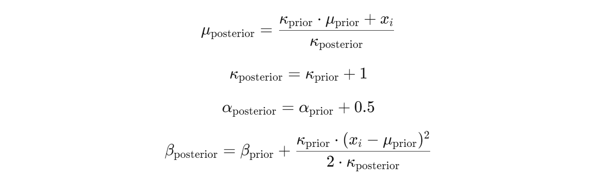

# AlphaQuantTrader

Welcome to the AlphaQuantTrader project! This powerful trading bot is designed to revolutionize the way you approach algorithmic trading by leveraging advanced machine learning techniques and Bayesian statistics.

## 1) What Exactly is AlphaQuantTrader?
AlphaQuantTrader is a sophisticated trading bot that utilizes reinforcement learning to automate and optimize stock trading decisions. It operates within a custom-built trading environment that simulates real-world market conditions, allowing the bot to make informed buy, hold, or sell decisions based on historical financial data. The bot is powered by a deep Q-network (DQN) model, which learns to maximize portfolio returns by continuously adapting to changing market conditions.

Additionally, AlphaQuantTrader incorporates Bayesian statistical methods to dynamically adjust risk and enhance decision-making, ensuring robust performance even in volatile markets.

## 2) Key Features

**2.1) Custom Trading Environment:**
AlphaQuantTrader is built on a custom Gym environment that accurately simulates trading activities, including transaction costs and portfolio management, offering a realistic trading experience.

**2.2) Deep Q-Network (DQN):**
At its core, the bot uses a DQN model to predict and execute the most profitable trading actions, learning from past market data to improve its strategies over time.

**2.3) Bayesian Risk Management:**
The bot integrates Bayesian updating techniques to adjust its risk management strategies dynamically, taking into account market volatility and uncertainty.

**2.4) Historical Data Processing:**
AlphaQuantTrader preprocesses historical market data, utilizing various technical indicators, statistical measures, and volatility analysis to inform its trading decisions.

**2.5) Portfolio Optimization:**
Through reinforcement learning, the bot continuously seeks to optimize its portfolio by balancing risk and reward, aiming to maximize long-term gains.

## 3) Why Use AlphaQuantTrader?

AlphaQuantTrader is ideal for traders and developers looking to automate and enhance their trading strategies with cutting-edge AI. Whether you're aiming to reduce the manual effort in trading or seeking a robust system that adapts to market changes, AlphaQuantTrader provides the tools and intelligence to help you stay ahead in the financial markets. With its combination of deep learning and Bayesian techniques, AlphaQuantTrader offers a strategic edge that goes beyond traditional trading algorithms.

# 4) Model Overview

Let's start by importimg the necessary libraries

```python
import yfinance as yf
import pandas as pd
import numpy as np
from scipy.stats import norm, skew, kurtosis
from sklearn.preprocessing import StandardScaler
import gym
from gym import spaces
import numpy as np
import pandas as pd
import random
from collections import namedtuple
import tensorflow as tf
from tensorflow.keras.models import Sequential
from tensorflow.keras.layers import LSTM, Dense, Dropout, ReLU, Input
from tensorflow.keras.optimizers import Adam
from tensorflow.keras.regularizers import l2
import matplotlib.pyplot as plt
```
## 5) Preprocessing

The preprocessing phase is crucial for preparing raw financial data into a form suitable for training the reinforcement learning model. This step involves acquiring historical market data, cleaning it, and engineering the necessary features to ensure that the model receives meaningful input for effective learning.

**5.1) Data Acquisition**

Historical stock price data for the National Stock Exchange of India (^NSEI) index is downloaded using the yfinance library. The dataset spans over 11.5 years, from January 21, 2013, to July 31, 2024, and is normalized before serving as the foundation for training, testing, and validating the reinforcement learning model.

```python
data = yf.download('^NSEI', start='2013-01-21', end='2024-07-31', interval='1d')
```
Here's a glimpse of the data we're working with. The first 10 rows of the data are as follows:
```
| RSI        | MACD_Histogram | VWAP        | Bollinger_Band_Width | 50_day_MA   | 20_day_MA   | 9_day_MA    | Skewness   | Kurtosis   | dynamic_rolling_variances | CDF        | Nor_Adj_Close |
|------------|----------------|-------------|----------------------|-------------|-------------|-------------|------------|------------|---------------------------|------------|---------------|
| 31.955411  | -0.060194      | -1.462427   | -0.492711             | -1.429522   | -1.458934   | -1.492421   | 0.288366   | -0.856547  | -0.389327                 | 0.589216   | -1.470435     |
| 29.391651  | -0.054519      | -1.464739   | -0.483284             | -1.432472   | -1.459385   | -1.495261   | 0.236524   | -0.978247  | 0.158286                  | 0.379025   | -1.496615     |
| 27.721806  | -0.203237      | -1.468015   | -0.409436             | -1.435887   | -1.463075   | -1.499912   | 0.094578   | -0.947947  | 0.635391                  | 0.337802   | -1.530784     |
| 19.556652  | -0.309120      | -1.471731   | -0.339685             | -1.439498   | -1.467749   | -1.504013   | 0.302799   | -0.825508  | 0.386888                  | 0.476451   | -1.538269     |
| 20.469411  | -0.362698      | -1.474321   | -0.293727             | -1.442931   | -1.473391   | -1.508227   | 0.455540   | -0.599875  | 0.116669                  | 0.498186   | -1.541855     |
| 20.091448  | -0.444192      | -1.478158   | -0.283511             | -1.447108   | -1.481328   | -1.513620   | 0.325813   | -0.646141  | -0.025186                 | 0.423713   | -1.558513     |
| 32.756245  | -0.346920      | -1.481539   | -0.338587             | -1.450828   | -1.488085   | -1.516843   | 0.478166   | -0.774842  | 0.514644                  | 0.647224   | -1.536372     |
| 40.468962  | -0.190394      | -1.484694   | -0.411093             | -1.454113   | -1.493723   | -1.520285   | 0.255360   | -0.963981  | 0.432596                  | 0.590046   | -1.524083     |
| 38.301869  | -0.177125      | -1.487965   | -0.431047             | -1.457913   | -1.499406   | -1.527121   | 0.252123   | -0.983150  | 0.548091                  | 0.382168   | -1.546868     |
| 42.957792  | -0.073499      | -1.491163   | -0.541240             | -1.461274   | -1.505404   | -1.534106   | 0.188423   | -0.977782  | 0.497006                  | 0.603417   | -1.532995     |

```
And the last 10 rows of the data are as follows:

```
| RSI        | MACD_Histogram | VWAP        | Bollinger_Band_Width | 50_day_MA   | 20_day_MA   | 9_day_MA    | Skewness   | Kurtosis   | dynamic_rolling_variances | CDF        | Nor_Adj_Close |
|------------|----------------|-------------|----------------------|-------------|-------------|-------------|------------|------------|---------------------------|------------|---------------|
| 42.527646  | -0.896734      | 1.950455    | 0.636007              | 2.833609    | 2.575108    | 2.554237    | -0.409604  | -0.511399  | 0.463655                  | 2.13E-124  | 2.312439      |
| 41.891021  | -1.123832      | 1.951993    | 0.729387              | 2.826262    | 2.562206    | 2.527068    | -0.420964  | -0.578321  | 1.003222                  | 1          | 2.366975      |
| 40.672664  | -0.853302      | 1.953345    | 0.728086              | 2.819489    | 2.554111    | 2.505245    | -0.593637  | -0.640503  | 1.253434                  | 1          | 2.431240      |
| 47.306983  | -0.398670      | 1.954657    | 0.615841              | 2.813195    | 2.545945    | 2.488191    | -0.593378  | -0.639957  | 0.982796                  | 1          | 2.472024      |
| 52.190567  | -0.170272      | 1.955863    | 0.621062              | 2.806073    | 2.545545    | 2.474022    | -0.227646  | -0.843989  | 0.754123                  | 6.42E-07   | 2.448055      |
| 47.627936  | 0.164088       | 1.956818    | 0.616688              | 2.798321    | 2.546114    | 2.464745    | -0.285838  | -0.861025  | 0.514884                  | 0.999998   | 2.476777      |
| 43.283158  | 0.657489       | 1.958015    | 0.596113              | 2.790355    | 2.550518    | 2.465206    | -0.505755  | -0.850246  | 0.391843                  | 1          | 2.527952      |
| 41.250978  | 0.937666       | 1.959117    | 0.598335              | 2.781250    | 2.551341    | 2.463853    | -0.351689  | -0.790676  | -0.027929                 | 0.037553   | 2.521112      |
| 41.153581  | 1.084516       | 1.961293    | 0.548161              | 2.772495    | 2.547859    | 2.472356    | -0.266748  | -0.648239  | -0.946615                 | 0.122264   | 2.517752      |
| 49.592960  | 1.411373       | 1.962448    | 0.580896              | 2.765918    | 2.550630    | 2.501117    | -0.593796  | -0.454717  | -0.906079                 | 1          | 2.570008      |

```

**Split the data based on the date**

```python
# Define the split dates
train_end_date = '2021-12-31'
val_end_date = '2022-12-31'
test_start_date = '2023-01-01'
```
**5.2) Data Preprocessing Functions**

```python
# Function to calculate daily returns
def calculate_log_returns(data):
    # Log return formula applied to the 'Adj Close' price
    log_returns = np.log(data['Adj Close'] / data['Adj Close'].shift(1))
    return log_returns

# Function to calculate RSI (Relative Strength Index)
def calculate_rsi(data, window=14):
    delta = data['Adj Close'].diff()
    gain = (delta.where(delta > 0, 0)).rolling(window=window).mean()
    loss = (-delta.where(delta < 0, 0)).rolling(window=window).mean()
    rs = gain / loss
    rsi = 100 - (100 / (1 + rs))
    return rsi

# Function to calculate MACD Histogram
def calculate_macd_histogram(data, short_window=12, long_window=26, signal_window=9):
    short_ema = data['Close'].ewm(span=short_window, adjust=False).mean()
    long_ema = data['Close'].ewm(span=long_window, adjust=False).mean()
    macd_line = short_ema - long_ema
    signal_line = macd_line.ewm(span=signal_window, adjust=False).mean()
    macd_histogram = macd_line - signal_line
    return macd_histogram

# Function to calculate VWAP
def calculate_vwap(data):
    typical_price = (data['High'] + data['Low'] + data['Close']) / 3
    vwap = (typical_price * data['Volume']).cumsum() / data['Volume'].cumsum()
    return vwap

# Function to calculate Bollinger Band Width
def calculate_bollinger_band_width(data, window=20, num_std_dev=2):
    middle_band = data['Adj Close'].rolling(window=window).mean()
    std_dev = data['Adj Close'].rolling(window=window).std()
    upper_band = middle_band + (num_std_dev * std_dev)
    lower_band = middle_band - (num_std_dev * std_dev)
    bollinger_band_width = upper_band - lower_band
    return bollinger_band_width

# Calculate features on the entire dataset
data['Log Returns'] = calculate_log_returns(data)
data['RSI'] = calculate_rsi(data)
data['MACD_Histogram'] = calculate_macd_histogram(data)
data['VWAP'] = calculate_vwap(data)
data['Bollinger_Band_Width'] = calculate_bollinger_band_width(data)
data['50_day_MA'] = data['Close'].rolling(window=50).mean()
data['20_day_MA'] = data['Close'].rolling(window=20).mean()
data['9_day_MA'] = data['Close'].rolling(window=9).mean()
data['Skewness'] = data['Log Returns'].rolling(window=20).apply(lambda x: skew(x, bias=False))
data['Kurtosis'] = data['Log Returns'].rolling(window=20).apply(lambda x: kurtosis(x, bias=False))
```
`calculate_log_returns(data)`: Computes the log returns of the stock based on the closing prices, which are essential for understanding the day-to-day movement of the stock.

`calculate_rsi(data, window=14)`: Calculates the Relative Strength Index (RSI), a momentum oscillator used to evaluate overbought or oversold conditions in the stock market. This is based on average gains and losses over a rolling window of 14 periods by default.

`calculate_macd_histogram(data, short_window=12, long_window=26, signal_window=9)`: Computes the Moving Average Convergence Divergence (MACD) histogram, which indicates the strength and direction of a stock’s momentum. The MACD is calculated using the difference between short-term and long-term exponential moving averages (EMAs).

`calculate_vwap(data)`: Calculates the Volume Weighted Average Price (VWAP), a trading benchmark that gives the average price a security has traded throughout the day, based on both volume and price.

`calculate_bollinger_band_width(data, window=20, num_std_dev=2)`: Computes the Bollinger Band Width, which measures the volatility of a stock by calculating the spread between the upper and lower Bollinger Bands, based on the moving average and standard deviation of adjusted closing prices over a rolling window.

**5.3) Skewness and Kurtosis**

`data['Skewness']`: Computes the rolling skewness of log returns over a 20-day window. Skewness measures the asymmetry of the return distribution, providing insights into whether returns are skewed more to the left (negative skew) or right (positive skew).

`data['Kurtosis']`: Computes the rolling kurtosis of log returns over a 20-day window. Kurtosis measures the "tailedness" of the return distribution, indicating whether returns have more or fewer extreme values (fat tails or thin tails) compared to a normal distribution.

 **5.4) Volatility and Dynamic Window Size Calculation**

In this phase of the project, the aim is to calculate market volatility and adjust the analysis window size dynamically based on this volatility. These steps are crucial for capturing the changing market dynamics more accurately. To better understand market conditions, it's important to calculate how much prices fluctuate over time (volatility) and adjust the analysis window size accordingly. Below is the code that handles these calculations:

```python
# Function to calculate fixed window rolling volatility (standard deviation)
def calculate_fixed_window_volatility(data, window_size=20):
    return data.rolling(window=window_size).std()

# Function to determine dynamic window size based on volatility
def determine_dynamic_window_size(volatility, min_window=5, max_window=20, epsilon=1e-8):
    # Add epsilon to volatility to avoid division by zero or near-zero values
    inverse_volatility = 1 / (volatility + epsilon)
    
    # Normalize the inverse volatility to scale between min and max window sizes
    normalized_window_size = (inverse_volatility - inverse_volatility.min()) / (inverse_volatility.max() - inverse_volatility.min())
    
    # Scale the normalized window size to the specified window range
    dynamic_window_size = normalized_window_size * (max_window - min_window) + min_window
    
    # Fill any NaN values with the minimum window size and convert to integers
    return dynamic_window_size.fillna(min_window).astype(int)

# Calculate volatility and dynamic window sizes
data.loc[:, 'volatility'] = calculate_fixed_window_volatility(data['Log Returns'])
data.loc[:, 'dynamic_window_sizes'] = determine_dynamic_window_size(data['volatility'])
```
This code block begins by calculating the rolling volatility of log returns using the `calculate_fixed_window_volatility` function. The function takes the daily returns and computes how volatile the market has been over the last 20 days, storing the results in the volatility column.

Next, the `determine_dynamic_window_size` function adjusts the window size dynamically based on the calculated volatility. This adjustment ensures that during periods of high volatility, the analysis focuses on more recent data by using a smaller window size. The dynamically adjusted window sizes are then stored in the dynamic_window_sizes column.

The calculated dynamic_window_size will later be used for more accurate volatility calculation in the subsequent steps.

**5.5) Dynamic Rolling Variance Calculation**

Building on the previous step where we generated dynamic_window_sizes, this section calculates the rolling variance of daily returns using an exponential moving average (EMA). The `calculate_rolling_variance` function applies EMA to the dynamically adjusted window sizes, ensuring that more recent data is emphasized during periods of high volatility.

```python
# Function to calculate rolling variance using exponential moving average (EMA)
def calculate_rolling_variance(data, window_size):
    return data.ewm(span=window_size).var()

# Initialize a list to store dynamic rolling variances, pre-filled with NaN values
dynamic_rolling_variances = [np.nan] * len(data)

# Calculate dynamic rolling variances for each data point
for idx, (_, row) in enumerate(data.iterrows()):
    window_size = int(row['dynamic_window_sizes'])  # Get dynamic window size for this row

    # Check if there are enough data points behind the current data point to create a window
    if idx < window_size - 1:
        continue  # Skip if not enough data points for rolling variance

    # Calculate rolling variance for the previous 'window_size' rows including current index
    start_idx = idx - window_size + 1
    end_idx = idx + 1
    data_window = data['Daily Returns'].iloc[start_idx : end_idx]

    # Calculate rolling variance
    dynamic_rolling_variance = calculate_rolling_variance(data_window, window_size).iloc[-1]

    # Store the result in the list at the correct index
    dynamic_rolling_variances[idx] = dynamic_rolling_variance

# Add the dynamic rolling variances as a new column to your DataFrame
data.loc[:, 'dynamic_rolling_variances'] = dynamic_rolling_variances
```
The code iterates through each data point, using the dynamic window size from the previous step to calculate the variance. This ensures that in more volatile market conditions, the rolling variance is calculated using a smaller, more focused window of recent data.

The dynamically calculated rolling variances are stored in a list and added as a new column, `dynamic_rolling_variances`, in the dataset. This allows the model to better capture how market variability evolves, adapting its analysis based on changes in volatility over time.

**Autocorrelation Function (ACF) and Partial Autocorrelation Function (PACF)**

In this project, a fixed window size of 20 was chosen for calculating rolling volatility. This decision was informed by analyzing the Autocorrelation Function (ACF) and Partial Autocorrelation Function (PACF) plots of the volatility data.


The ACF plot shows the correlation between the volatility and its lagged values, while the PACF plot helps in understanding the direct relationship between volatility and its lags, excluding the influence of intermediate lags.

Upon examining these plots, it was observed that the significant correlations and patterns start to diminish around the 20th lag. This indicates that a 20-day window effectively captures the relevant historical volatility, making it a suitable choice for the fixed window size in this context.

This selection ensures that the model accounts for the most impactful recent volatility trends, without incorporating too much noise from older data.

**5.6) Bayesian Updating with Normal-Inverse-Gamma**

In this project, Bayesian updating continues to play a key role in dynamically estimating the mean and variance of market returns. This section introduces the `Normal-Inverse-Gamma` conjugate prior, which allows us to update our estimates of the mean and variance efficiently. The Normal-Inverse-Gamma distribution is especially useful for modeling uncertainty in both the mean and variance of the returns.

Just as in the previous steps, this iterative Bayesian process ensures that the model adapts to incoming data, making it more robust and flexible in a dynamic market environment. By continuously updating the parameters, we can refine our understanding of market returns and make more informed decisions.

Why Use the Normal-Inverse-Gamma?

The Normal-Inverse-Gamma conjugate prior is chosen because it allows for simultaneous updating of both the mean and variance. This is crucial in financial markets, where both the average returns and volatility evolve over time. This Bayesian approach updates the posterior estimates of the mean (mu), the variance (sigma²), and the parameters governing these distributions, leading to more accurate and adaptive predictions.

Specifically, the Bayesian method helps in calculating:

`Posterior mean (mu_posterior)`: Updated based on new daily return data.

`Posterior variance (sigma²)`: Calculated using the updated posterior parameters.

**The Bayesian Formulas Used**

The code starts by defining initial priors:

```python
mu_prior = 0  # Prior mean
kappa_prior = 1  # Prior precision factor
alpha_prior = 3  # Prior alpha for Inverse-Gamma
beta_prior = 2  # Prior beta for Inverse-Gamma
```
These priors represent our initial assumptions about the market's behavior:

`mu_prior` is the prior mean, set to 0.

`kappa_prior` is the prior precision, set to 1, representing initial certainty.

`alpha_prior` and `beta_prior` are parameters for the Inverse-Gamma distribution, governing our initial belief about the volatility.

The code then employs Bayesian formulas to update the posterior mean and variance, as well as to adjust the parameters of the Inverse-Gamma distribution, which models the uncertainty in volatility.

**Updating the Posterior Mean, Precision, and Variance**

The posterior mean (`mu_posterior`) and variance (`sigma²`) are updated using the following formulas:



Where:
* `x_i` represents the new daily return data point.
  
* `mu_prior` and `kappa_prior` are the prior estimates for the mean and precision.
  
* `alpha_prior` and `beta_prior` are the prior parameters governing volatility.
  
These formulas describe how the posterior estimates are updated. The posterior mean (`mu_posterior`) is a weighted combination of the prior mean and the new data point `x_i`, where the weights are determined by the precision (`kappa`). The posterior precision (`kappa_posterior`) increases by 1 with each new observation, reflecting greater certainty in the estimate of the mean. `Alpha` increases by 0.5 with each observation, and beta adjusts based on how much the new observation deviates from the `prior mean`, weighted by the prior precision. These updates ensure that the model incorporates new information while retaining prior knowledge.

```python
def update_posterior(x_i, mu_prior, kappa_prior, alpha_prior, beta_prior):
    """Update posterior parameters using the Normal-Inverse-Gamma conjugate prior."""
    # Update kappa
    kappa_posterior = kappa_prior + 1
    
    # Update mu
    mu_posterior = (kappa_prior * mu_prior + x_i) / kappa_posterior
    
    # Update alpha
    alpha_posterior = alpha_prior + 0.5
    
    # Update beta
    beta_posterior = beta_prior + (kappa_prior * (x_i - mu_prior) ** 2) / (2 * kappa_posterior)
    
    return mu_posterior, kappa_posterior, alpha_posterior, beta_posterior
```
**Posterior Variance Formula**
    
After updating the posterior parameters, the variance of the mean is calculated. The variance reflects the uncertainty in our estimate of the mean and is based on the updated posterior parameters.


Where:
* `beta_posterior` and `alpha_posterior` are the updated parameters from the previous step.

* `kappa_posterior` is the updated precision, which influences the certainty of the mean.
  
The expected variance (`sigma^2_expected`) is calculated by dividing the updated posterior beta by the updated posterior alpha minus 1. The posterior variance of the mean (`sigma^2_posterior`) is then derived by dividing the expected variance by the updated precision (`kappa_posterior`). A higher precision results in lower variance, indicating that the model has more certainty about its mean estimate as new data is processed.

```python
  def calculate_posterior_variance(kappa_posterior, alpha_posterior, beta_posterior):
    """Calculate the posterior variance of mu."""
    # Expected variance (sigma^2)
    expected_variance = beta_posterior / (alpha_posterior - 1)
    
    # Posterior variance of mu
    sigma_posterior_squared = expected_variance / kappa_posterior
    
    return sigma_posterior_squared
```
**Iterating Bayesian Updates and Calculating the CDF**

After updating the posterior mean and variance for each data point in the dataset, we now use these updated estimates to calculate the Cumulative Distribution Function (CDF). The CDF is important because it helps us assess the probability that a particular daily return will be below a certain threshold, giving insight into the likelihood of different market outcomes. By utilizing the updated posterior parameters, including the mean and variance, we can calculate the CDF for each daily return, which reflects the probability distribution based on new data.


```python
cdfs = {}

# Loop through the data for Bayesian updates
for i, row in data.iterrows():
    x_i = row['Log Returns']
    
    # Update posterior parameters
    mu_posterior, kappa_posterior, alpha_posterior, beta_posterior = update_posterior(
        x_i, mu_prior, kappa_prior, alpha_prior, beta_prior)
    
    # Calculate posterior variance of mu
    sigma_posterior_squared = calculate_posterior_variance(kappa_posterior, alpha_posterior, beta_posterior)
    
    # Store posterior mean and standard deviation
    updated_bayes_means[i] = mu_posterior
    updated_bayes_sds[i] = np.sqrt(sigma_posterior_squared)
    
    # Calculate CDF
    cdfs[i] = norm.cdf(x_i, mu_posterior, np.sqrt(sigma_posterior_squared))
    
    # Update priors for next iteration
    mu_prior, kappa_prior, alpha_prior, beta_prior = mu_posterior, kappa_posterior, alpha_posterior, beta_posterior

# Store the calculated CDF values in the DataFrame
data.loc[:, 'CDF'] = data.index.map(cdfs)
```
In this section, the code iterates through each observation in the dataset. For each log return (`x_i`), the posterior parameters for the mean (`mu_posterior`), precision (`kappa_posterior`), and variance-controlling parameters (`alpha_posterior`, `beta_posterior`) are updated using Bayesian updating, just like in the previous step. After updating the parameters, the posterior variance (`sigma_posterior_squared`) of the mean is calculated, giving us an updated sense of the uncertainty around the mean estimate.

Next, the CDF is computed using the updated posterior mean and variance. This step uses the `norm.cdf` function, which calculates the probability that a given return will be less than or equal to x_i based on the updated distribution. The CDF values represent these probabilities for each data point. After calculating the CDF, the priors are updated with the new posterior values, allowing the model to continuously adapt as more data comes in. This ensures that each new observation refines our estimates further, making the model more adaptive and accurate over time.

Finally, all the calculated CDF values are stored in a new column (`CDF`) in the data DataFrame, making it easy to access and use them for further analysis or decision-making.

# 6) Model Training

In this section, we move into the model training phase of our project, where we aim to develop a strategy for trading based on the financial data we have preprocessed. To achieve this, we use reinforcement learning (RL), a powerful machine learning approach that allows our model to learn from its own actions in a simulated environment. One of the most effective tools for developing RL models is the OpenAI Gym library. OpenAI Gym provides a collection of environments — computational representations of problems — that standardize how agents (our models) interact with these environments. This allows us to build, test, and compare various RL strategies effectively.

**6.1) What is an Environment in OpenAI Gym?**

In the context of reinforcement learning, an environment is essentially a problem that the agent (our trading model) tries to solve. It defines the state space (all possible situations the agent might encounter), the action space (all possible moves the agent can make), and the reward structure (how good or bad each action is, given the current state). The OpenAI Gym library provides a convenient framework for building these environments and includes many pre-built environments for classic RL problems like cart-pole balancing, playing video games, and more. However, since our problem is a custom financial trading scenario, we need to create a custom environment that reflects the dynamics of trading in a financial market.

-----------------------------------------------------------------------------------------------------------------
**6.2) Creating a Custom Trading Environment**

To model our trading scenario, we define a custom environment class named TradingEnv by extending the gym.Env class from OpenAI Gym. This custom environment will simulate the process of trading a financial asset, allowing our RL model to interact with it by buying, holding, or selling based on the available data.

```python
class TradingEnv(gym.Env):
    def __init__(self, data, initial_balance=1000000, transaction_cost=0.0000135, max_num_timesteps = len(data) ):
        super(TradingEnv, self).__init__()

        self.data = data
        self.initial_balance = initial_balance
        self.transaction_cost = transaction_cost
        # Calculate max_num_timesteps dynamically based on the length of the data
        self.max_num_timesteps = max_num_timesteps

        self.balance = self.initial_balance
        self.stock_owned = 0
        self.current_step = 0
        self.current_position = None
        self.entry_price = None

        self.trading_history = []

        self.action_space = spaces.Discrete(3)

        self.observation_space = spaces.Box(
            low=0, high=np.inf, shape=(8,), dtype=np.float32)

    def reset(self):
        self.balance = self.initial_balance
        self.stock_owned = 0
      #  Calculate a random starting point with enough data left for max_num_timesteps
        self.current_step = np.random.randint(0, len(self.data) - self.max_num_timesteps + 1)
        self.current_position = None
        self.entry_price = None
        self.trading_history = []
        return normalize_state(self._get_observation())

    def step(self, action):
        if self.current_step >= len(self.data):
            raise ValueError("Current step exceeds the length of the data")
        
        if action not in [0, 1, 2]:
            raise ValueError("Invalid action")

        current_data = self.data.iloc[self.current_step]
        current_price = current_data['Adj Close']
        reward = 0
    
        if action == 2:  # Buy
            if self.current_position is None or self.current_position == 'sell':
                self.current_position = 'buy'
                self.entry_price = current_price
                shares_to_buy = (self.balance * 0.15) / (current_price * (1 + self.transaction_cost))
                self.stock_owned += shares_to_buy
                self.balance -= shares_to_buy * current_price * (1 + self.transaction_cost)
                reward = 0
            else:
                self.current_position = 'hold'
                previous_price = self.data.iloc[self.current_step - 1]['Adj Close']
                reward = current_price - previous_price
    
        elif action == 1:  # Hold
            if self.current_position == 'buy' or self.current_position == 'hold':
                previous_price = self.data.iloc[self.current_step - 1]['Adj Close']
                reward = current_price - previous_price
    
        elif action == 0:  # Sell
            if self.current_position == 'buy' or self.current_position == 'hold':
                reward = current_price - self.entry_price
                self.balance += self.stock_owned * current_price * (1 - self.transaction_cost)
                self.stock_owned = 0
                self.entry_price = None
                self.current_position = 'sell'
            else:
                reward = -0.5
                
        
        # Use the precomputed Bayesian standard deviation
        bayes_std = self.data['updated_bayes_sds'].iloc[self.current_step]

        # Avoid division by zero and apply scaling factor
        scaling_factor = 0.005  # scaling factor
        if bayes_std == 0 or np.isnan(bayes_std):
            risk_adjusted_reward = reward
        else:
            risk_adjusted_reward = (reward / (bayes_std + 1e-6)) * scaling_factor

        
        self.current_step += 1
        done = self.current_step >= len(self.data) - 1
        if done:
            self.balance += self.stock_owned * current_price * (1 - self.transaction_cost)
            self.stock_owned = 0

        portfolio_value = self.balance + self.stock_owned * current_price

        self.trading_history.append({
            'step': self.current_step,
            'current_price': current_price,
            'balance': self.balance,
            'portfolio_value': portfolio_value
        })
        
        # Return the raw state, normalization will be done outside this method
        raw_state = self._get_observation()

        return raw_state, risk_adjusted_reward, done, {"portfolio_value": portfolio_value}

    def _get_observation(self):
        if self.current_step >= len(self.data):
            raise ValueError("Current step exceeds the length of the data")
        
        current_data = self.data.iloc[self.current_step]
        return np.array([
            self.balance,
            self.stock_owned,
            current_data['Adj Close'],
            current_data['Daily Returns'],
            current_data['volatility'],
            current_data['updated_bayes_means'],
            current_data['updated_bayes_sds'],
            current_data['CDF']
        ], dtype=np.float32)

    def render(self, mode='human', close=False):
        if close:
            plt.close()
            return

        df = pd.DataFrame(self.trading_history)
        df.set_index('step', inplace=True)

        fig, ax = plt.subplots(3, 1, figsize=(12, 10), sharex=True)

        ax[0].plot(df.index, df['current_price'], label='Price')
        ax[0].set_ylabel('Price')
        ax[0].legend()

        ax[1].plot(df.index, df['balance'], label='Balance')
        ax[1].set_ylabel('Balance')
        ax[1].legend()

        ax[2].plot(df.index, df['portfolio_value'], label='Portfolio Value')
        ax[2].set_ylabel('Portfolio Value')
        ax[2].set_xlabel('Step')
        ax[2].legend()

        plt.show()
```

**Initialization (__init__ method): This sets up the initial conditions of our trading environment:**

* The initial balance is set to $1,000,000.
* The transaction cost per trade is set to 0.0000135, which is typical for financial markets.
* We define the maximum number of timesteps based on the length of the input data, setting a limit on how many steps the model can take in one episode.
* Other variables like `balance`, `stock_owned`, `current_step`, `current_position`, `entry_price`, `trading_history`, `action_space`, and `observation_space` are initialized to track the agent's state.

**Action and Observation Space:**

* Action Space: Defined using `spaces.Discrete(3)`, representing three possible actions: `0` (Sell), `1` (Hold), and `2` (Buy).
* Observation Space: Defined using `spaces.Box`, representing the financial state of the agent, including `balance, number of stocks owned, and various financial indicators (like adjusted close price, daily returns, volatility, Bayesian updated mean, standard deviation, and CDF).

**Reset Method:** Resets the environment to its initial state, allowing the model to start fresh from a random point in the data, ensuring a diverse learning experience.

**Step Method:**

* Implements the core logic of the trading strategy. Depending on the chosen action (Buy, Hold, Sell), the method updates the balance, stock holdings, and calculates the reward.
* Uses precomputed Bayesian standard deviation to adjust the reward based on risk, encouraging the agent to prefer less risky trades.
* Tracks the trading history for later analysis and visualization.

**Observation Method (`_get_observation`):** Provides the current state of the environment as a NumPy array, capturing essential details required for decision-making by the RL agent.

 **Render Method:** Provides visualization for the trading performance over time, plotting price, balance, and portfolio value, which is useful for debugging and understanding the agent’s decisions

**6.3) Predefined Strategy**

To kickstart our reinforcement learning model, we've developed a strategy to pre-populate the memory buffer with meaningful experiences. This strategy allows the model to start learning from a more informed baseline, rather than from completely random actions.

```python
def predefined_strategy(env, num_steps):
    previous_cdf = None
    current_position = None  # can be 'buy', 'hold', or 'sell'
    entry_price = None  # price at which the asset was bought
    balance = env.initial_balance
    stock_owned = 0
    transaction_cost = env.transaction_cost
    trading_results = []

    for index in range(num_steps):
        row = env.data.iloc[index]
        current_cdf = row['CDF']
        current_price = row['Adj Close']
        reward = 0
        action = None

        if previous_cdf is None:
            previous_cdf = current_cdf
            trading_results.append((None, 0, balance, stock_owned))
            continue

        if current_cdf > previous_cdf:
            if current_position is None or current_position == 'sell':
                current_position = 'buy'
                entry_price = current_price
                shares_to_buy = (balance * 0.15) / (current_price * (1 + transaction_cost))
                stock_owned += shares_to_buy
                balance -= shares_to_buy * current_price * (1 + transaction_cost)
                action = 2  # Buy
            else:
                current_position = 'hold'
                action = 1  # Hold
                if index > 0:
                    previous_price = env.data.iloc[index - 1]['Adj Close']
                    reward = current_price - previous_price
        elif current_cdf == previous_cdf:
            if current_position == 'buy' or current_position == 'hold':
                current_position = 'hold'
                action = 1  # Hold
                if index > 0:
                    previous_price = env.data.iloc[index - 1]['Adj Close']
                    reward = current_price - previous_price
        else:  # current_cdf < previous_cdf
            if current_position == 'buy' or current_position == 'hold':
                current_position = 'sell'
                action = 0  # Sell
                reward = current_price - entry_price
                balance += stock_owned * current_price * (1 - transaction_cost)
                stock_owned = 0
                entry_price = None
            else:
                current_position = None
                action = 0  # Sell
                reward = -0.5

        if current_position is None:
            reward = -0.5
       
        previous_cdf = current_cdf
     
        trading_results.append((action, reward, balance, stock_owned))

    if current_position == 'buy' or current_position == 'hold':
        balance += stock_owned * current_price * (1 - transaction_cost)
        stock_owned = 0

    return trading_results

def normalize_state(state):
    state_df = pd.DataFrame([state], columns=feature_names)
    print(f"State shape before normalization: {state_df.shape}")
    normalized_state = scaler.transform(state_df)
    print(f"State shape after normalization: {normalized_state.shape}")
    return normalized_state.flatten()

def store_experience(memory_buffer, experience):
    memory_buffer.append(experience)

def generate_initial_experiences(env, memory_buffer, num_steps):
    state = env.reset()
    state = normalize_state(state)
    state = state.reshape(1, state_size, 1)

    trading_results = predefined_strategy(env, num_steps)

    for index, (action, reward, balance, stock_owned) in enumerate(trading_results):
      
        if action is None or action not in [0, 1, 2]:
           # print(f"Invalid action at index {index}: {action}")
            continue  # Skip this step if action is invalid
        next_state, _, _, _ = env.step(action)
        next_state = normalize_state(next_state)
        next_state = next_state.reshape(1, state_size, 1)

        done = (index == len(trading_results) - 1)
        exp = experience(state, action, reward, next_state, done)
        store_experience(memory_buffer, exp)

        state = next_state

def setup_timesteps(num_episodes, dataset_size, min_percentage, max_percentage):
    min_timesteps = int(dataset_size * min_percentage)
    max_timesteps = int(dataset_size * max_percentage)
    
    timesteps_per_episode = []
    for _ in range(num_episodes):
        timesteps = random.randint(min_timesteps, max_timesteps)
        timesteps_per_episode.append(timesteps)
    return timesteps_per_episode

num_episodes = 600  # Number of episodes
dataset_size = len(data)  # Size of the dataset
min_percentage = 0.30 # Minimum percentage of the dataset size (30%)
max_percentage = 0.40  # Maximum percentage of the dataset size (40%)
num_timesteps = setup_timesteps(num_episodes, dataset_size, min_percentage, max_percentage)

memory_buffer = deque(maxlen=100000)  # Set replay buffer size to 100000
  
initial_population_size = 20000 
current_population = 0

for episode_timesteps in num_timesteps:
    if current_population >= initial_population_size:
        break
    generate_initial_experiences(env, memory_buffer, episode_timesteps)
    current_population = len(memory_buffer)
```
The function `predefined_strategy(env, num_steps)` is designed to generate a sequence of trading actions based on simple logic involving the cumulative distribution function (CDF) of price movements. The goal of this function is to simulate a trading agent that interacts with the environment and fills up the memory buffer with initial experiences.

The predefined_strategy function outputs a list of trading results that contains the actions taken and the corresponding rewards.

**State Normalization Function:**

The `normalize_state(state)` function is a utility that normalizes the state using a pre-fitted scaler. This is crucial because machine learning models perform better with normalized input data.

* Normalization Process: The input state is first converted to a DataFrame. The scaler, assumed to be pre-fitted on the training data, transforms the state features to a normalized scale. This normalized state is then flattened to be used as input for the model.

**Experience Storage Function:**

The `store_experience(memory_buffer, experience)` function adds an experience to the memory buffer.

* Experience Replay: In reinforcement learning, experiences consist of state transitions and are used to train the model. The memory_buffer is a deque object that stores these experiences up to a certain capacity (100,000 in this case).

**Generate Initial Experiences Function:**

The `generate_initial_experiences(env, memory_buffer, num_steps)` function fills the memory buffer with initial trading experiences.

* It resets the environment and obtains the initial state.
* The `predefined_strategy` function is used to generate a series of predefined trading actions and results.
* For each trading result, it steps through the environment, normalizes the next state, and stores the experience in the memory buffer.

**Timesteps Setup Function**

The `setup_timesteps(num_episodes, dataset_size, min_percentage, max_percentage)` function calculates random numbers of timesteps for each episode.

* It generates a list of random timesteps for each episode based on a percentage range of the dataset size.
* This randomness helps in creating varied lengths of experiences, making training more robust

**Main Loop for Initial Experience Population**

This code block initializes the memory buffer with initial experiences:

* It sets up parameters such as the number of episodes and dataset size.
* It initializes a memory buffer to store up to 100,000 experiences.
* A loop iterates to populate the buffer with experiences generated from the predefined strategy until it reaches a specified size (20,000).

Overall, this setup prepares the trading agent by providing a diverse set of initial experiences, which are crucial for effective reinforcement learning before starting the actual training process.


