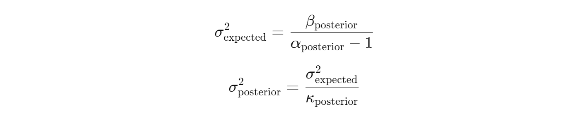

# AlphaQuantTrader

Welcome to the AlphaQuantTrader project! This powerful trading bot is designed to revolutionize the way you approach algorithmic trading by leveraging advanced machine learning techniques and Bayesian statistics.

## 1) What Exactly is AlphaQuantTrader?
AlphaQuantTrader is a sophisticated trading bot that utilizes reinforcement learning to automate and optimize stock trading decisions. It operates within a custom-built trading environment that simulates real-world market conditions, allowing the bot to make informed buy, hold, or sell decisions based on historical financial data. The bot is powered by a deep Q-network (DQN) model, which learns to maximize portfolio returns by continuously adapting to changing market conditions.

Additionally, AlphaQuantTrader incorporates Bayesian statistical methods to dynamically adjust risk and enhance decision-making, ensuring robust performance even in volatile markets.

## 2) Key Features

**2.1) Custom Trading Environment:**
AlphaQuantTrader is built on a custom Gym environment that accurately simulates trading activities, including transaction costs and portfolio management, offering a realistic trading experience.

**2.2) Deep Q-Network (DQN):**
At its core, the bot uses a DQN model to predict and execute the most profitable trading actions, learning from past market data to improve its strategies over time.

**2.3) Bayesian Risk Management:**
The bot integrates Bayesian updating techniques to adjust its risk management strategies dynamically, taking into account market volatility and uncertainty.

**2.4) Historical Data Processing:**
AlphaQuantTrader preprocesses historical market data, utilizing various technical indicators, statistical measures, and volatility analysis to inform its trading decisions.

**2.5) Portfolio Optimization:**
Through reinforcement learning, the bot continuously seeks to optimize its portfolio by balancing risk and reward, aiming to maximize long-term gains.

## 3) Why Use AlphaQuantTrader?

AlphaQuantTrader is ideal for traders and developers looking to automate and enhance their trading strategies with cutting-edge AI. Whether you're aiming to reduce the manual effort in trading or seeking a robust system that adapts to market changes, AlphaQuantTrader provides the tools and intelligence to help you stay ahead in the financial markets. With its combination of deep learning and Bayesian techniques, AlphaQuantTrader offers a strategic edge that goes beyond traditional trading algorithms.

# 4) Model Overview

Let's start by importimg the necessary libraries

```python
import yfinance as yf
import pandas as pd
import numpy as np
from scipy.stats import norm, skew, kurtosis
from sklearn.preprocessing import StandardScaler
import gym
from gym import spaces
import numpy as np
import pandas as pd
import random
from collections import namedtuple
import tensorflow as tf
from tensorflow.keras.models import Sequential
from tensorflow.keras.layers import LSTM, Dense, Dropout, Input, Conv1D, ReLU, Bidirectional, BatchNormalization
from tensorflow.keras.optimizers import Adam
from tensorflow.keras.regularizers import l2
import matplotlib.pyplot as plt
```
## 5) Preprocessing

The preprocessing phase is crucial for preparing raw financial data into a form suitable for training the reinforcement learning model. This step involves acquiring historical market data, cleaning it, and engineering the necessary features to ensure that the model receives meaningful input for effective learning.

**5.1) Data Acquisition**

Historical stock price data for the National Stock Exchange of India (^NSEI) index is downloaded using the yfinance library. The dataset spans over 11.5 years, from January 21, 2013, to July 31, 2024, and is normalized before serving as the foundation for training, testing, and validating the reinforcement learning model.

```python
data = yf.download('^NSEI', start='2013-01-21', end='2024-07-31', interval='1d')
```
Here's a glimpse of the data we're working with. The first 10 rows of the data are as follows:
```
| RSI        | MACD_Histogram | VWAP        | Bollinger_Band_Width | 50_day_MA   | 20_day_MA   | 9_day_MA    | Skewness   | Kurtosis   | dynamic_rolling_variances | CDF        | Nor_Adj_Close |
|------------|----------------|-------------|----------------------|-------------|-------------|-------------|------------|------------|---------------------------|------------|---------------|
| 31.955411  | -0.060194      | -1.462427   | -0.492711             | -1.429522   | -1.458934   | -1.492421   | 0.288366   | -0.856547  | -0.389327                 | 0.589216   | -1.470435     |
| 29.391651  | -0.054519      | -1.464739   | -0.483284             | -1.432472   | -1.459385   | -1.495261   | 0.236524   | -0.978247  | 0.158286                  | 0.379025   | -1.496615     |
| 27.721806  | -0.203237      | -1.468015   | -0.409436             | -1.435887   | -1.463075   | -1.499912   | 0.094578   | -0.947947  | 0.635391                  | 0.337802   | -1.530784     |
| 19.556652  | -0.309120      | -1.471731   | -0.339685             | -1.439498   | -1.467749   | -1.504013   | 0.302799   | -0.825508  | 0.386888                  | 0.476451   | -1.538269     |
| 20.469411  | -0.362698      | -1.474321   | -0.293727             | -1.442931   | -1.473391   | -1.508227   | 0.455540   | -0.599875  | 0.116669                  | 0.498186   | -1.541855     |
| 20.091448  | -0.444192      | -1.478158   | -0.283511             | -1.447108   | -1.481328   | -1.513620   | 0.325813   | -0.646141  | -0.025186                 | 0.423713   | -1.558513     |
| 32.756245  | -0.346920      | -1.481539   | -0.338587             | -1.450828   | -1.488085   | -1.516843   | 0.478166   | -0.774842  | 0.514644                  | 0.647224   | -1.536372     |
| 40.468962  | -0.190394      | -1.484694   | -0.411093             | -1.454113   | -1.493723   | -1.520285   | 0.255360   | -0.963981  | 0.432596                  | 0.590046   | -1.524083     |
| 38.301869  | -0.177125      | -1.487965   | -0.431047             | -1.457913   | -1.499406   | -1.527121   | 0.252123   | -0.983150  | 0.548091                  | 0.382168   | -1.546868     |
| 42.957792  | -0.073499      | -1.491163   | -0.541240             | -1.461274   | -1.505404   | -1.534106   | 0.188423   | -0.977782  | 0.497006                  | 0.603417   | -1.532995     |

```
And the last 10 rows of the data are as follows:

```
| RSI        | MACD_Histogram | VWAP        | Bollinger_Band_Width | 50_day_MA   | 20_day_MA   | 9_day_MA    | Skewness   | Kurtosis   | dynamic_rolling_variances | CDF        | Nor_Adj_Close |
|------------|----------------|-------------|----------------------|-------------|-------------|-------------|------------|------------|---------------------------|------------|---------------|
| 42.527646  | -0.896734      | 1.950455    | 0.636007              | 2.833609    | 2.575108    | 2.554237    | -0.409604  | -0.511399  | 0.463655                  | 2.13E-124  | 2.312439      |
| 41.891021  | -1.123832      | 1.951993    | 0.729387              | 2.826262    | 2.562206    | 2.527068    | -0.420964  | -0.578321  | 1.003222                  | 1          | 2.366975      |
| 40.672664  | -0.853302      | 1.953345    | 0.728086              | 2.819489    | 2.554111    | 2.505245    | -0.593637  | -0.640503  | 1.253434                  | 1          | 2.431240      |
| 47.306983  | -0.398670      | 1.954657    | 0.615841              | 2.813195    | 2.545945    | 2.488191    | -0.593378  | -0.639957  | 0.982796                  | 1          | 2.472024      |
| 52.190567  | -0.170272      | 1.955863    | 0.621062              | 2.806073    | 2.545545    | 2.474022    | -0.227646  | -0.843989  | 0.754123                  | 6.42E-07   | 2.448055      |
| 47.627936  | 0.164088       | 1.956818    | 0.616688              | 2.798321    | 2.546114    | 2.464745    | -0.285838  | -0.861025  | 0.514884                  | 0.999998   | 2.476777      |
| 43.283158  | 0.657489       | 1.958015    | 0.596113              | 2.790355    | 2.550518    | 2.465206    | -0.505755  | -0.850246  | 0.391843                  | 1          | 2.527952      |
| 41.250978  | 0.937666       | 1.959117    | 0.598335              | 2.781250    | 2.551341    | 2.463853    | -0.351689  | -0.790676  | -0.027929                 | 0.037553   | 2.521112      |
| 41.153581  | 1.084516       | 1.961293    | 0.548161              | 2.772495    | 2.547859    | 2.472356    | -0.266748  | -0.648239  | -0.946615                 | 0.122264   | 2.517752      |
| 49.592960  | 1.411373       | 1.962448    | 0.580896              | 2.765918    | 2.550630    | 2.501117    | -0.593796  | -0.454717  | -0.906079                 | 1          | 2.570008      |

```

**Split the data based on the date**

```python
# Define the split dates
train_end_date = '2021-12-31'
val_end_date = '2022-12-31'
test_start_date = '2023-01-01'
```
**5.2) Data Preprocessing Functions**

```python
# Function to calculate daily returns
def calculate_log_returns(data):
    # Log return formula applied to the 'Adj Close' price
    log_returns = np.log(data['Adj Close'] / data['Adj Close'].shift(1))
    return log_returns

# Function to calculate RSI (Relative Strength Index)
def calculate_rsi(data, window=14):
    delta = data['Adj Close'].diff()
    gain = (delta.where(delta > 0, 0)).rolling(window=window).mean()
    loss = (-delta.where(delta < 0, 0)).rolling(window=window).mean()
    rs = gain / loss
    rsi = 100 - (100 / (1 + rs))
    return rsi

# Function to calculate MACD Histogram
def calculate_macd_histogram(data, short_window=12, long_window=26, signal_window=9):
    short_ema = data['Close'].ewm(span=short_window, adjust=False).mean()
    long_ema = data['Close'].ewm(span=long_window, adjust=False).mean()
    macd_line = short_ema - long_ema
    signal_line = macd_line.ewm(span=signal_window, adjust=False).mean()
    macd_histogram = macd_line - signal_line
    return macd_histogram

# Function to calculate VWAP
def calculate_vwap(data):
    typical_price = (data['High'] + data['Low'] + data['Close']) / 3
    vwap = (typical_price * data['Volume']).cumsum() / data['Volume'].cumsum()
    return vwap

# Function to calculate Bollinger Band Width
def calculate_bollinger_band_width(data, window=20, num_std_dev=2):
    middle_band = data['Adj Close'].rolling(window=window).mean()
    std_dev = data['Adj Close'].rolling(window=window).std()
    upper_band = middle_band + (num_std_dev * std_dev)
    lower_band = middle_band - (num_std_dev * std_dev)
    bollinger_band_width = upper_band - lower_band
    return bollinger_band_width

# Calculate features on the entire dataset
data['Log Returns'] = calculate_log_returns(data)
data['RSI'] = calculate_rsi(data)
data['MACD_Histogram'] = calculate_macd_histogram(data)
data['VWAP'] = calculate_vwap(data)
data['Bollinger_Band_Width'] = calculate_bollinger_band_width(data)
data['50_day_MA'] = data['Close'].rolling(window=50).mean()
data['20_day_MA'] = data['Close'].rolling(window=20).mean()
data['9_day_MA'] = data['Close'].rolling(window=9).mean()
data['Skewness'] = data['Log Returns'].rolling(window=20).apply(lambda x: skew(x, bias=False))
data['Kurtosis'] = data['Log Returns'].rolling(window=20).apply(lambda x: kurtosis(x, bias=False))
```
`calculate_log_returns(data)`: Computes the log returns of the stock based on the closing prices, which are essential for understanding the day-to-day movement of the stock.

`calculate_rsi(data, window=14)`: Calculates the Relative Strength Index (RSI), a momentum oscillator used to evaluate overbought or oversold conditions in the stock market. This is based on average gains and losses over a rolling window of 14 periods by default.

`calculate_macd_histogram(data, short_window=12, long_window=26, signal_window=9)`: Computes the Moving Average Convergence Divergence (MACD) histogram, which indicates the strength and direction of a stock’s momentum. The MACD is calculated using the difference between short-term and long-term exponential moving averages (EMAs).

`calculate_vwap(data)`: Calculates the Volume Weighted Average Price (VWAP), a trading benchmark that gives the average price a security has traded throughout the day, based on both volume and price.

`calculate_bollinger_band_width(data, window=20, num_std_dev=2)`: Computes the Bollinger Band Width, which measures the volatility of a stock by calculating the spread between the upper and lower Bollinger Bands, based on the moving average and standard deviation of adjusted closing prices over a rolling window.

**5.3) Skewness and Kurtosis**

`data['Skewness']`: Computes the rolling skewness of log returns over a 20-day window. Skewness measures the asymmetry of the return distribution, providing insights into whether returns are skewed more to the left (negative skew) or right (positive skew).

`data['Kurtosis']`: Computes the rolling kurtosis of log returns over a 20-day window. Kurtosis measures the "tailedness" of the return distribution, indicating whether returns have more or fewer extreme values (fat tails or thin tails) compared to a normal distribution.

 **5.4) Volatility and Dynamic Window Size Calculation**

In this phase of the project, the aim is to calculate market volatility and adjust the analysis window size dynamically based on this volatility. These steps are crucial for capturing the changing market dynamics more accurately. To better understand market conditions, it's important to calculate how much prices fluctuate over time (volatility) and adjust the analysis window size accordingly. Below is the code that handles these calculations:

```python
# Function to calculate fixed window rolling volatility (standard deviation)
def calculate_fixed_window_volatility(data, window_size=20):
    return data.rolling(window=window_size).std()

# Function to determine dynamic window size based on volatility
def determine_dynamic_window_size(volatility, min_window=5, max_window=20, epsilon=1e-8):
    # Add epsilon to volatility to avoid division by zero or near-zero values
    inverse_volatility = 1 / (volatility + epsilon)
    
    # Normalize the inverse volatility to scale between min and max window sizes
    normalized_window_size = (inverse_volatility - inverse_volatility.min()) / (inverse_volatility.max() - inverse_volatility.min())
    
    # Scale the normalized window size to the specified window range
    dynamic_window_size = normalized_window_size * (max_window - min_window) + min_window
    
    # Fill any NaN values with the minimum window size and convert to integers
    return dynamic_window_size.fillna(min_window).astype(int)

# Calculate volatility and dynamic window sizes
data.loc[:, 'volatility'] = calculate_fixed_window_volatility(data['Log Returns'])
data.loc[:, 'dynamic_window_sizes'] = determine_dynamic_window_size(data['volatility'])
```
This code block begins by calculating the rolling volatility of log returns using the `calculate_fixed_window_volatility` function. The function takes the daily returns and computes how volatile the market has been over the last 20 days, storing the results in the volatility column.

Next, the `determine_dynamic_window_size` function adjusts the window size dynamically based on the calculated volatility. This adjustment ensures that during periods of high volatility, the analysis focuses on more recent data by using a smaller window size. The dynamically adjusted window sizes are then stored in the dynamic_window_sizes column.

The calculated dynamic_window_size will later be used for more accurate volatility calculation in the subsequent steps.

**5.5) Dynamic Rolling Variance Calculation**

Building on the previous step where we generated dynamic_window_sizes, this section calculates the rolling variance of daily returns using an exponential moving average (EMA). The `calculate_rolling_variance` function applies EMA to the dynamically adjusted window sizes, ensuring that more recent data is emphasized during periods of high volatility.

```python
# Function to calculate rolling variance using exponential moving average (EMA)
def calculate_rolling_variance(data, window_size):
    return data.ewm(span=window_size).var()

# Initialize a list to store dynamic rolling variances, pre-filled with NaN values
dynamic_rolling_variances = [np.nan] * len(data)

# Calculate dynamic rolling variances for each data point
for idx, (_, row) in enumerate(data.iterrows()):
    window_size = int(row['dynamic_window_sizes'])  # Get dynamic window size for this row

    # Check if there are enough data points behind the current data point to create a window
    if idx < window_size - 1:
        continue  # Skip if not enough data points for rolling variance

    # Calculate rolling variance for the previous 'window_size' rows including current index
    start_idx = idx - window_size + 1
    end_idx = idx + 1
    data_window = data['Daily Returns'].iloc[start_idx : end_idx]

    # Calculate rolling variance
    dynamic_rolling_variance = calculate_rolling_variance(data_window, window_size).iloc[-1]

    # Store the result in the list at the correct index
    dynamic_rolling_variances[idx] = dynamic_rolling_variance

# Add the dynamic rolling variances as a new column to your DataFrame
data.loc[:, 'dynamic_rolling_variances'] = dynamic_rolling_variances
```
The code iterates through each data point, using the dynamic window size from the previous step to calculate the variance. This ensures that in more volatile market conditions, the rolling variance is calculated using a smaller, more focused window of recent data.

The dynamically calculated rolling variances are stored in a list and added as a new column, `dynamic_rolling_variances`, in the dataset. This allows the model to better capture how market variability evolves, adapting its analysis based on changes in volatility over time.

**Autocorrelation Function (ACF) and Partial Autocorrelation Function (PACF)**

In this project, a fixed window size of 20 was chosen for calculating rolling volatility. This decision was informed by analyzing the Autocorrelation Function (ACF) and Partial Autocorrelation Function (PACF) plots of the volatility data.


The ACF plot shows the correlation between the volatility and its lagged values, while the PACF plot helps in understanding the direct relationship between volatility and its lags, excluding the influence of intermediate lags.

Upon examining these plots, it was observed that the significant correlations and patterns start to diminish around the 20th lag. This indicates that a 20-day window effectively captures the relevant historical volatility, making it a suitable choice for the fixed window size in this context.

This selection ensures that the model accounts for the most impactful recent volatility trends, without incorporating too much noise from older data.

**5.6) Bayesian Updating with Normal-Inverse-Gamma**

In this project, Bayesian updating continues to play a key role in dynamically estimating the mean and variance of market returns. This section introduces the `Normal-Inverse-Gamma` conjugate prior, which allows us to update our estimates of the mean and variance efficiently. The Normal-Inverse-Gamma distribution is especially useful for modeling uncertainty in both the mean and variance of the returns.

Just as in the previous steps, this iterative Bayesian process ensures that the model adapts to incoming data, making it more robust and flexible in a dynamic market environment. By continuously updating the parameters, we can refine our understanding of market returns and make more informed decisions.

Why Use the Normal-Inverse-Gamma?

The Normal-Inverse-Gamma conjugate prior is chosen because it allows for simultaneous updating of both the mean and variance. This is crucial in financial markets, where both the average returns and volatility evolve over time. This Bayesian approach updates the posterior estimates of the mean (mu), the variance (sigma²), and the parameters governing these distributions, leading to more accurate and adaptive predictions.

Specifically, the Bayesian method helps in calculating:

`Posterior mean (mu_posterior)`: Updated based on new daily return data.

`Posterior variance (sigma²)`: Calculated using the updated posterior parameters.

**The Bayesian Formulas Used**

The code starts by defining initial priors:

```python
mu_prior = 0  # Prior mean
kappa_prior = 1  # Prior precision factor
alpha_prior = 3  # Prior alpha for Inverse-Gamma
beta_prior = 2  # Prior beta for Inverse-Gamma
```
These priors represent our initial assumptions about the market's behavior:

`mu_prior` is the prior mean, set to 0.

`kappa_prior` is the prior precision, set to 1, representing initial certainty.

`alpha_prior` and `beta_prior` are parameters for the Inverse-Gamma distribution, governing our initial belief about the volatility.

The code then employs Bayesian formulas to update the posterior mean and variance, as well as to adjust the parameters of the Inverse-Gamma distribution, which models the uncertainty in volatility.

**Updating the Posterior Mean, Precision, and Variance**

The posterior mean (`mu_posterior`) and variance (`sigma²`) are updated using the following formulas:


Where:
* `x_i` represents the new daily return data point.
  
* `mu_prior` and `kappa_prior` are the prior estimates for the mean and precision.
  
* `alpha_prior` and `beta_prior` are the prior parameters governing volatility.
  
These formulas describe how the posterior estimates are updated. The posterior mean (`mu_posterior`) is a weighted combination of the prior mean and the new data point `x_i`, where the weights are determined by the precision (`kappa`). The posterior precision (`kappa_posterior`) increases by 1 with each new observation, reflecting greater certainty in the estimate of the mean. `Alpha` increases by 0.5 with each observation, and beta adjusts based on how much the new observation deviates from the `prior mean`, weighted by the prior precision. These updates ensure that the model incorporates new information while retaining prior knowledge.

```python
def update_posterior(x_i, mu_prior, kappa_prior, alpha_prior, beta_prior):
    """Update posterior parameters using the Normal-Inverse-Gamma conjugate prior."""
    # Update kappa
    kappa_posterior = kappa_prior + 1
    
    # Update mu
    mu_posterior = (kappa_prior * mu_prior + x_i) / kappa_posterior
    
    # Update alpha
    alpha_posterior = alpha_prior + 0.5
    
    # Update beta
    beta_posterior = beta_prior + (kappa_prior * (x_i - mu_prior) ** 2) / (2 * kappa_posterior)
    
    return mu_posterior, kappa_posterior, alpha_posterior, beta_posterior
```
**Posterior Variance Formula**
    
After updating the posterior parameters, the variance of the mean is calculated. The variance reflects the uncertainty in our estimate of the mean and is based on the updated posterior parameters.



Where:
* `beta_posterior` and `alpha_posterior` are the updated parameters from the previous step.

* `kappa_posterior` is the updated precision, which influences the certainty of the mean.
  
The expected variance (`sigma^2_expected`) is calculated by dividing the updated posterior beta by the updated posterior alpha minus 1. The posterior variance of the mean (`sigma^2_posterior`) is then derived by dividing the expected variance by the updated precision (`kappa_posterior`). A higher precision results in lower variance, indicating that the model has more certainty about its mean estimate as new data is processed.

```python
  def calculate_posterior_variance(kappa_posterior, alpha_posterior, beta_posterior):
    """Calculate the posterior variance of mu."""
    # Expected variance (sigma^2)
    expected_variance = beta_posterior / (alpha_posterior - 1)
    
    # Posterior variance of mu
    sigma_posterior_squared = expected_variance / kappa_posterior
    
    return sigma_posterior_squared
```
**Iterating Bayesian Updates and Calculating the CDF**

After updating the posterior mean and variance for each data point in the dataset, we now use these updated estimates to calculate the Cumulative Distribution Function (CDF). The CDF is important because it helps us assess the probability that a particular daily return will be below a certain threshold, giving insight into the likelihood of different market outcomes. By utilizing the updated posterior parameters, including the mean and variance, we can calculate the CDF for each daily return, which reflects the probability distribution based on new data.


```python
cdfs = {}

# Loop through the data for Bayesian updates
for i, row in data.iterrows():
    x_i = row['Log Returns']
    
    # Update posterior parameters
    mu_posterior, kappa_posterior, alpha_posterior, beta_posterior = update_posterior(
        x_i, mu_prior, kappa_prior, alpha_prior, beta_prior)
    
    # Calculate posterior variance of mu
    sigma_posterior_squared = calculate_posterior_variance(kappa_posterior, alpha_posterior, beta_posterior)
    
    # Store posterior mean and standard deviation
    updated_bayes_means[i] = mu_posterior
    updated_bayes_sds[i] = np.sqrt(sigma_posterior_squared)
    
    # Calculate CDF
    cdfs[i] = norm.cdf(x_i, mu_posterior, np.sqrt(sigma_posterior_squared))
    
    # Update priors for next iteration
    mu_prior, kappa_prior, alpha_prior, beta_prior = mu_posterior, kappa_posterior, alpha_posterior, beta_posterior

# Store the calculated CDF values in the DataFrame
data.loc[:, 'CDF'] = data.index.map(cdfs)
```
In this section, the code iterates through each observation in the dataset. For each log return (`x_i`), the posterior parameters for the mean (`mu_posterior`), precision (`kappa_posterior`), and variance-controlling parameters (`alpha_posterior`, `beta_posterior`) are updated using Bayesian updating, just like in the previous step. After updating the parameters, the posterior variance (`sigma_posterior_squared`) of the mean is calculated, giving us an updated sense of the uncertainty around the mean estimate.

Next, the CDF is computed using the updated posterior mean and variance. This step uses the `norm.cdf` function, which calculates the probability that a given return will be less than or equal to x_i based on the updated distribution. The CDF values represent these probabilities for each data point. After calculating the CDF, the priors are updated with the new posterior values, allowing the model to continuously adapt as more data comes in. This ensures that each new observation refines our estimates further, making the model more adaptive and accurate over time.

Finally, all the calculated CDF values are stored in a new column (`CDF`) in the data DataFrame, making it easy to access and use them for further analysis or decision-making.

# 6) Model Training

In this section, we move into the model training phase of our project, where we aim to develop a strategy for trading based on the financial data we have preprocessed. To achieve this, we use reinforcement learning (RL), a powerful machine learning approach that allows our model to learn from its own actions in a simulated environment. One of the most effective tools for developing RL models is the OpenAI Gym library. OpenAI Gym provides a collection of environments — computational representations of problems — that standardize how agents (our models) interact with these environments. This allows us to build, test, and compare various RL strategies effectively.

**6.1) What is an Environment in OpenAI Gym?**

In the context of reinforcement learning, an environment is essentially a problem that the agent (our trading model) tries to solve. It defines the state space (all possible situations the agent might encounter), the action space (all possible moves the agent can make), and the reward structure (how good or bad each action is, given the current state). The OpenAI Gym library provides a convenient framework for building these environments and includes many pre-built environments for classic RL problems like cart-pole balancing, playing video games, and more. However, since our problem is a custom financial trading scenario, we need to create a custom environment that reflects the dynamics of trading in a financial market.

**6.2) Feature Normalization and Data Splitting**

In this step, we split the dataset into training and validation sets and normalize specific features to ensure the model performs optimally. We exclude certain features like the RSI and CDF from normalization since they represent ratios and probabilities, which don’t require scaling. The normalization process ensures that all features, aside from `RSI` and `CDF`, are on a consistent scale, making it easier for the model to learn from the data.

```python
# List of features to normalize (excluding 'RSI' and 'CDF')
features_to_normalize = [
    'Nor_Adj_Close', 'MACD_Histogram', 'VWAP',
    '50_day_MA', '20_day_MA', '9_day_MA',
    'Skewness', 'Kurtosis', 'dynamic_rolling_variances'
]

# Split the data into training and validation sets
train_end_date = '2021-12-31'
val_end_date = '2022-12-31'

train_data = data[data.index <= train_end_date].copy()
val_data = data[(data.index > train_end_date) & (data.index <= val_end_date)].copy()

# Ensure there's no overlap
assert train_data.index.max() < val_data.index.min(), "Training and validation data overlap!"

# Normalize features using scalers fitted on training data
scaler = StandardScaler()
train_data[features_to_normalize] = scaler.fit_transform(train_data[features_to_normalize])
val_data[features_to_normalize] = scaler.transform(val_data[features_to_normalize])

# Reset indices but keep the date as a column
train_data.reset_index(inplace=True)
val_data.reset_index(inplace=True)
train_data.rename(columns={'index': 'Date'}, inplace=True)
val_data.rename(columns={'index': 'Date'}, inplace=True)

# Ensure 'Date' columns are datetime
train_data['Date'] = pd.to_datetime(train_data['Date'])
val_data['Date'] = pd.to_datetime(val_data['Date'])
```
The features to be normalized include values such as adjusted close prices, technical indicators like MACD Histogram, and statistical measures like skewness. However, we intentionally avoid normalizing RSI and CDF because RSI is a bounded ratio between 0 and 100, and CDF represents probabilities, both of which are already on a standard scale. The dataset is split into training data (up to the end of 2021) and validation data (2022). We fit a StandardScaler on the training data, ensuring both the training and validation sets are scaled similarly. Lastly, the indices are reset and converted to datetime format, making the data ready for use in the next steps.

**6.3) Creating a Custom Trading Environment**

To model our trading scenario, we define a custom environment class named TradingEnv by extending the gym.Env class from OpenAI Gym. This custom environment will simulate the process of trading a financial asset, allowing our RL model to interact with it by buying, holding, or selling based on the available data.

Let's walk through the custom environment, breaking it down into separate parts with explanations.

**Initialization (__init__)**

The `__init__` function sets up the environment with necessary parameters and variables. This includes the initial balance, transaction costs, lookback window, and the dataset used for training. It also defines the action space (Buy, Hold, Sell) and observation space for the reinforcement learning model.

```python
class TradingEnv(gym.Env):
    def __init__(self, data, initial_balance=1000000, transaction_cost=0.000135, lookback_window=10):
        super(TradingEnv, self).__init__()

        # Dataset and parameters
        self.data = data
        self.initial_balance = initial_balance
        self.transaction_cost = transaction_cost
        self.lookback_window = lookback_window

        # Define min and max percentage for episode length calculation
        self.min_percentage = 0.30
        self.max_percentage = 0.90

        # Environment state
        self.balance = self.initial_balance
        self.stock_owned = 0
        self.current_step = 0
        self.current_position = None
        self.entry_price = None
        self.last_action = None
        self.profit_target_reached = False
        self.trading_history = []

        # Action space: Buy, Hold, Sell
        self.action_space = gym.spaces.Discrete(3)
        
        # Observation space: shape is (lookback_window, n_features), i.e., sequence of timesteps
        self.n_features = len(self._get_observation())
        self.observation_space = gym.spaces.Box(
            low=-np.inf, high=np.inf, shape=(self.lookback_window, self.n_features), dtype=np.float32
        )

        # Initialize a tracker to ensure each datapoint is covered
        self.datapoints_covered = np.zeros(len(self.data) - self.lookback_window, dtype=bool)
```
This function initializes the trading environment. The dataset (data) contains historical market data, and the agent starts with a predefined balance (initial_balance). The agent can choose between three actions: Buy, Hold, and Sell, defined in the action_space. The environment tracks essential variables like stock owned, current balance, and trading history. It also sets up a lookback window to observe past market data and normalize the data, ensuring that the environment processes data over a range of time steps.

The `observation_space` defines the shape of the data the model receives at each timestep, which includes the lookback window's worth of market and internal state features.

**Observation Function (_get_observation)**

The `_get_observation` function generates a single feature vector (observation) for the current timestep. It pulls data such as adjusted close price, RSI, MACD Histogram, and internal state features (balance, stock owned, and last action).

```python
def _get_observation(self, index=None):
    """
    Return a single observation (a feature vector) from the dataset.
    The observation corresponds to the timestep at the provided index,
    including internal state features.
    """
    if index is None:
        index = self.current_step
    if index >= len(self.data):
        raise ValueError("Current step exceeds the length of the data")

    current_data = self.data.iloc[index]

    # Construct the feature vector with the specified features
    observation = np.array([
        current_data['Nor_Adj_Close'],
        current_data['RSI'],
        current_data['MACD_Histogram'],
        current_data['VWAP'],
        current_data['Bollinger_Band_Width'],
        current_data['50_day_MA'],
        current_data['20_day_MA'],
        current_data['9_day_MA'],
        current_data['Skewness'],
        current_data['Kurtosis'],
        current_data['dynamic_rolling_variances'],
        current_data['CDF'],
        # Internal state features
        self.balance / self.initial_balance,  # Normalize balance
        self.stock_owned,
        self.last_action if self.last_action is not None else -1  # Last action taken (-1 if none)
    ], dtype=np.float32)

    return observation
```
This function pulls relevant features from the dataset and combines them with internal state variables like current balance, stock owned, and the last action. This observation is what the agent receives at each timestep to make trading decisions. It is designed to provide a snapshot of the market's current state, including technical indicators like MACD Histogram, RSI, and other calculated features. Internal features (e.g., normalized balance) help the agent keep track of its portfolio.

**Setup Timesteps Function (_setup_timesteps)**

The `_setup_timesteps` function calculates the number of timesteps (or duration) for each episode, based on how much data remains and random intervals.

```python
def _setup_timesteps(self, start_index):
    """
    Setup the number of timesteps for an episode, based on the start index and remaining data.
    Returns 0 if there are not enough sequences to form at least one timestep.
    """
    dataset_size = len(self.data)
    remaining_data = dataset_size - (start_index + 1)
    remaining_sequences = remaining_data - (self.lookback_window - 1)
    
    if remaining_sequences < 1:
        return 0

    # Calculate min and max timesteps based on percentages
    min_timesteps = max(1, int(remaining_sequences * self.min_percentage))
    max_timesteps = int(remaining_sequences * self.max_percentage)
    
    if max_timesteps <= min_timesteps:
        max_timesteps = min_timesteps + 1
    
    num_timesteps = np.random.randint(min_timesteps, max_timesteps)
    num_timesteps = min(num_timesteps, remaining_sequences)
    
    return num_timesteps
```
The environment uses this function to decide the length of each episode dynamically, based on the amount of data left in the dataset. It ensures that the environment has enough data to process meaningful trading sequences. The random selection of timesteps between the minimum and maximum percentages keeps each episode varied, making the environment more dynamic for the reinforcement learning model.

**Reset Function (reset)**

The `reset` function restores the environment to its initial state at the start of each new episode, selecting a valid starting point for the agent to begin trading.

```python
def reset(self):
    """
    Reset the environment to the initial state and return the first sequence.
    Randomly select a starting point from uncovered datapoints.
    If no valid starting point is found, reset the tracker and attempt again.
    """
    # Reset environment variables
    self.balance = self.initial_balance
    self.stock_owned = 0
    self.current_position = None
    self.entry_price = None
    self.trading_history = []

    # Attempt to find a valid starting point
    valid_start_found = False
    max_attempts = len(self.datapoints_covered)  # Prevent infinite loop
    attempts = 0

    while not valid_start_found and attempts < max_attempts:
        uncovered_indices = np.where(self.datapoints_covered == False)[0]
        
        if len(uncovered_indices) == 0:
            self.datapoints_covered[:] = False
            uncovered_indices = np.where(self.datapoints_covered == False)[0]
            if len(uncovered_indices) == 0:
                raise ValueError("Dataset too small to form any sequences.")
        
        selected_index = np.random.choice(uncovered_indices)
        self.current_step = selected_index + (self.lookback_window - 1)
        
        self.num_timesteps = self._setup_timesteps(self.current_step)
        
        if self.num_timesteps > 0:
            valid_start_found = True
            start_cover = self.current_step - self.lookback_window + 1
            end_cover = self.current_step + 1
            self.datapoints_covered[start_cover:end_cover] = True
            return self._get_sequence(self.current_step)
        else:
            self.datapoints_covered[selected_index] = True
            attempts += 1
            print(f"Skipping episode starting at index {selected_index} due to insufficient data.")

    if not valid_start_found:
        self.datapoints_covered[:] = False
        print("Resetting datapoints_covered tracker and attempting to reset again.")
        return self.reset()
```
This function resets the environment at the beginning of each episode. It restores the initial balance, clears the trading history, and randomly selects an uncovered starting point from the dataset. The function ensures that enough data is available to form valid trading sequences. If not enough data is available, it resets the data tracker and tries again, ensuring fair starting points for every episode.

**Reset Evaluation Function (reset_eval)**

The `reset_eval` function resets the environment specifically for evaluation, always starting from the beginning of the dataset.

```python
def reset_eval(self):
    """
    Reset the environment to the initial state for evaluation/testing.
    Start from the beginning of the dataset.
    """
    self.balance = self.initial_balance
    self.stock_owned = 0
    self.current_position = None
    self.entry_price = None
    self.trading_history = []
    self.profit_target_reached = False

    self.current_step = self.lookback_window - 1
    return self._get_sequence(self.current_step)
```
This function is a simplified reset used during the evaluation phase. It resets all internal states like balance, stock ownership, and trading history but starts from the beginning of the dataset, unlike

**Get Sequence Function (_get_sequence)**

The `_get_sequence` function returns a sequence of timesteps based on the current step, using the lookback window to gather past observations and the present one.

```python
def _get_sequence(self, current_step):
    """
    Return a sequence of timesteps looking back from the current step.
    The sequence includes the current step and the previous lookback_window - 1 steps.
    """
    if current_step < self.lookback_window - 1:
        raise ValueError("Not enough data points to create the lookback window")

    sequence_start = current_step - self.lookback_window + 1
    sequence_end = current_step + 1  # Include the current step

    # Collect the sequence of observations for each timestep in the window
    sequence = []
    for i in range(sequence_start, sequence_end):
        observation = self._get_observation(i)  # Get the observation for each timestep
        sequence.append(observation)

    return np.array(sequence).astype(np.float32)
```
This function provides the reinforcement learning model with a sequence of observations. It uses the current step and a lookback window to collect data from both past and present timesteps, forming the "input history" for the model. This ensures that the agent can consider historical data when making decisions. The function checks that there is enough data to form a sequence and raises an error if the dataset is too small.

**Step Function (step)**

The `step` function processes the agent’s action and returns the next sequence, reward, and a flag indicating whether the episode is finished. It also updates the agent’s portfolio, calculates transaction costs, and rewards based on the chosen action.

```python
def step(self, action):
        """
        Take an action, calculate the reward, and return the next sequence.
        """
        # Record the current price
        current_price = self.data.iloc[self.current_step]['Adj Close']
        
        # Initialize variables
        reward = 0
        transaction_cost_value = 0
    
       
        # Scaling factors
        immediate_reward_scale = 1.0  # Scale for immediate rewards (e.g., price difference rewards)
        sharpe_ratio_scale = 100
        
        # Handle the actions: 0 = Sell, 1 = Hold, 2 = Buy
        if action == 2:  # Buy
            if self.stock_owned == 0:
                # Buy with 15% of balance (as before)
                max_shares = (self.balance * 0.10) / current_price
                if max_shares >= 1:
                    shares_to_buy = np.floor(max_shares)
                    total_purchase = shares_to_buy * current_price
                    transaction_cost_value = total_purchase * self.transaction_cost
                    total_cost = total_purchase + transaction_cost_value
                    self.stock_owned += shares_to_buy
                    self.balance -= total_cost
                    self.entry_price = current_price  # Track the purchase price
                    
                    # No reward or penalty for buying; just tracking the position
                    reward = 0 
                else:
                    # penalty for overspending 
                    reward -= 10 * immediate_reward_scale
            else:
                # penalizing for repitative buying 
                reward -= 10 * immediate_reward_scale
    
        elif action == 1:  # Hold
            if self.stock_owned > 0:
                # Calculate the difference between the current price and the entry price
                price_difference = current_price - self.entry_price
                reward = price_difference * self.stock_owned  # Reward is profit or loss on held stock
    
                # Scale the immediate reward
                reward *= immediate_reward_scale
    
            else:
                # penalty for holding with out stock held
                reward -= 10 * immediate_reward_scale
    
        elif action == 0:  # Sell
            if self.stock_owned > 0:
                # Calculate profit or loss based on sell price and buy price
                price_difference = current_price - self.entry_price
                reward = price_difference * self.stock_owned  # Reward is profit or loss on sold stock
    
                # Sell all shares
                gross_sell_value = self.stock_owned * current_price
                transaction_cost_value = gross_sell_value * self.transaction_cost
                net_sell_value = gross_sell_value - transaction_cost_value
                self.balance += net_sell_value
                self.stock_owned = 0
                self.entry_price = None
    
                # Scale the immediate reward
                reward *= immediate_reward_scale
    
            else:
                # Penalty for attempting to sell without holding any stock
                reward -= 10 * immediate_reward_scale  # Penalty remains the same
    
        # Update last action
        self.last_action = action
    
        # Move the step forward
        self.current_step += 1
    
        # Update net worth
        current_net_worth = self.balance + self.stock_owned * current_price
    
        # Set reward to zero for the buy action (no immediate feedback for buy)
        if action == 2:
            reward = 0  # No reward for buying
    
        # Check if we're done
        done = self.current_step >= len(self.data) - 1
    
        # If done, liquidate any remaining stock holdings
        if done and self.stock_owned > 0:
            # Sell all shares at current price
            gross_sell_value = self.stock_owned * current_price
            transaction_cost_value = gross_sell_value * self.transaction_cost
            net_sell_value = gross_sell_value - transaction_cost_value
            self.balance += net_sell_value
            self.stock_owned = 0
            self.entry_price = None
            # Update net worth
            current_net_worth = self.balance
    
        # If done (end of the episode), calculate Sharpe Ratio and add it as a scaled reward
        if done:
            historical_net_worth = [entry['portfolio_value'] for entry in self.trading_history]
            returns = np.diff(historical_net_worth)
            sharpe_ratio = self.calculate_sharpe_ratio(returns)
    
            # Scale the Sharpe Ratio to make it comparable to immediate rewards
            scaled_sharpe_ratio = sharpe_ratio * sharpe_ratio_scale  # Example scaling factor
    
            # Add the scaled Sharpe Ratio as a final bonus reward
            reward += scaled_sharpe_ratio
    
        # Task completion reward (10% total return)
        if not self.profit_target_reached and current_net_worth >= self.initial_balance * 1.10:
            # Calculate bonus as 10% of profit
            profit = current_net_worth - self.initial_balance
            bonus_reward = profit * 0.10
            reward += bonus_reward
            self.profit_target_reached = True
    
        # Log the trading history
        self.trading_history.append({
            'step': self.current_step,
            'current_price': current_price,
            'balance': self.balance,
            'portfolio_value': current_net_worth,
            'reward': reward,
            'action': action
        })
    
        # Get the next sequence after the action
        if not done:
            next_sequence = self._get_sequence(self.current_step)
        else:
            # Ensure next_sequence is a NumPy array of the correct shape filled with zeros
            next_sequence = np.zeros_like(self._get_sequence(self.current_step - 1))
    
        return next_sequence, reward, done, {"portfolio_value": current_net_worth}
```
The step function processes the agent’s chosen action and returns the next observation sequence, reward, and done flag. The agent can choose to buy, hold, or sell stocks. Buying involves purchasing stock with a portion of the available balance, holding maintains the stock position, and selling involves liquidating the holdings. Rewards are calculated based on the change in stock price relative to the entry price, with penalties for invalid actions (e.g., selling without holding stock). At the end of the episode, the Sharpe ratio is calculated and added to the reward, and any remaining stock is liquidated.

 **Calculate Sharpe Ratio Function (calculate_sharpe_ratio)**

 The `calculate_sharpe_ratio` function computes the Sharpe ratio for the agent's trading performance, based on the returns and a given risk-free rate.

```python
def calculate_sharpe_ratio(self, returns, risk_free_rate=0.02):
    """
    Calculate the Sharpe ratio based on the returns.
    """
    excess_returns = returns - risk_free_rate
    sharpe_ratio = np.mean(excess_returns) / (np.std(excess_returns) + 1e-9)
    return sharpe_ratio
```
This function calculates the Sharpe ratio, a popular metric for evaluating the risk-adjusted return of an investment. It measures the excess return per unit of risk taken, where the risk is represented by the standard deviation of returns. The higher the Sharpe ratio, the better the risk-adjusted performance. In this case, it is used as a final bonus reward at the end of each episode.

**Render Function (render)**

The `render` function plots the portfolio value, rewards, and actions over the course of an episode, providing a visual representation of the agent's performance.

```python
def render(self, mode='human'):
    """
    Render plots showing the portfolio value, rewards, and actions over the episode.
    """
    if len(self.trading_history) == 0:
        print("No trading history available for this episode.")
        return

    steps = [entry['step'] for entry in self.trading_history]
    portfolio_values = [entry['portfolio_value'] for entry in self.trading_history]
    rewards = [entry['reward'] for entry in self.trading_history]
    prices = [entry['current_price'] for entry in self.trading_history]
    
    actions = [entry.get('action', None) for entry in self.trading_history]

    fig, axs = plt.subplots(3, 1, figsize=(12, 15))

    axs[0].plot(steps, portfolio_values, label='Portfolio Value', color='blue')
    axs[0].set_title('Portfolio Value Over Time')
    axs[0].set_xlabel('Timestep')
    axs[0].set_ylabel('Portfolio Value (INR)')
    axs[0].legend()
    axs[0].grid(True)

    cumulative_rewards = np.cumsum(rewards)
    axs[1].plot(steps, rewards, label='Reward', color='orange')
    axs[1].plot(steps, cumulative_rewards, label='Cumulative Reward', color='green', linestyle='--')
    axs[1].set_title('Rewards Over Time')
    axs[1].set_xlabel('Timestep')
    axs[1].set_ylabel('Reward')
    axs[1].legend()
    axs[1].grid(True)

    axs[2].plot(steps, prices, label='Price', color='black')
    
    buy_steps = [step for step, action in zip(steps, actions) if action == 2]
    buy_prices = [price for price, action in zip(prices, actions) if action == 2]
    sell_steps = [step for step, action in zip(steps, actions) if action == 0]
    sell_prices = [price for price, action in zip(prices, actions) if action == 0]
    hold_steps = [step for step, action in zip(steps, actions) if action == 1]
    hold_prices = [price for price, action in zip(prices, actions) if action == 
```

**6.4) SumTree Class for Prioritized Experience Replay**

The SumTree is an essential data structure used in Prioritized Experience Replay, which helps in efficiently sampling experiences based on their priority. The SumTree stores experiences along with their associated priorities and ensures that experiences with higher priority are sampled more frequently during training.

```python
class SumTree:
    def __init__(self, capacity):
        self.capacity = capacity  # Number of leaf nodes (experiences)
        self.tree = np.zeros(2 * capacity - 1)  # Binary tree array
        self.data = np.zeros(capacity, dtype=object)  # Experience storage
        self.size = 0
        self.data_pointer = 0

    def add(self, priority, data):
        idx = self.data_pointer + self.capacity - 1
        self.data[self.data_pointer] = data
        self.update(idx, priority)

        self.data_pointer += 1
        if self.data_pointer >= self.capacity:  # Replace when full
            self.data_pointer = 0

        self.size = min(self.size + 1, self.capacity)

    def update(self, idx, priority):
        change = priority - self.tree[idx]
        self.tree[idx] = priority

        while idx != 0:
            idx = (idx - 1) // 2
            self.tree[idx] += change

    def get_leaf(self, value):
        parent_idx = 0
        while True:
            left_child_idx = 2 * parent_idx + 1
            right_child_idx = left_child_idx + 1

            if left_child_idx >= len(self.tree):
                leaf_idx = parent_idx
                break
            else:
                if value <= self.tree[left_child_idx]:
                    parent_idx = left_child_idx
                else:
                    value -= self.tree[left_child_idx]
                    parent_idx = right_child_idx

        data_idx = leaf_idx - self.capacity + 1
        return leaf_idx, self.tree[leaf_idx], self.data[data_idx]

    def total_priority(self):
        return self.tree[0]  # Root node
```
Sum tree operates with a fixed capacity, storing experiences and their associated priorities in a binary tree structure (`self.tree`), while the actual experiences are stored in a separate array (`self.data`). The `add` function inserts new experiences with a priority, and as the buffer fills, older experiences are cyclically replaced. The `update` function adjusts the priority of a specific experience, propagating the changes through the tree to maintain accurate total priority values. The `get_leaf` function performs a binary search to sample an experience based on its priority, ensuring that experiences with higher priorities are more likely to be selected. Finally, the `total_priority` function returns the total sum of all priorities, which is stored at the root of the tree and used for probability-based sampling. This structure enables the system to efficiently prioritize important experiences during training.

**6.5) Setting Up the Environment and Prioritized Experience Replay Buffer**

At this stage of the project, we are defining the trading environments and setting up the replay buffer using a SumTree structure. The replay buffer will store experiences that the agent learns from, and the prioritization ensures that the most important experiences are sampled more frequently during training. This section also initializes the beta parameter, which helps control the importance-sampling weights during training, ensuring that the agent learns from both high-priority and random experiences over time.

```python
# Define the named tuple for experience
Experience = namedtuple("Experience", field_names=["state", "action", "reward", "next_state", "done"])

# Setting up the environments
env = TradingEnv(train_data)
val_env = TradingEnv(val_data)
num_episodes = 550  # Adjust the number of episodes as needed

# Create the replay buffer using the SumTree class
MEMORY_SIZE = 50000
memory_buffer = SumTree(capacity=MEMORY_SIZE)  # Set replay buffer size to 50,000
alpha = 0.6  # Prioritization exponent

# Initialize beta parameters for importance-sampling weights
beta_start = 0.4  # Starting value for beta
beta_end = 1.0  # Final value for beta
beta_increment_per_episode = (beta_end - beta_start) / num_episodes

# Initialize beta
beta = beta_start
```
In this code, we begin by defining `Experience` to store each step of the agent’s interaction with the environment. We then set up the training and validation environments using the `TradingEnv` class. The replay buffer is created with a `SumTree` structure, which allows us to efficiently store and prioritize up to 50,000 experiences. The parameter `alpha` controls how much prioritization is applied, and `beta` is initialized to adjust the importance-sampling weights, increasing its value gradually over 550 episodes to ensure that the agent learns from both highly prioritized and randomly selected experiences.

**6.6 Storing and Sampling Experiences in Prioritized Experience Replay**

As the agent interacts with the environment, it gathers experiences that are crucial for learning. These two functions handle the storage of experiences in the replay buffer and the sampling of experiences with prioritization, making sure that more significant experiences have a higher probability of being replayed during training. This is essential for improving the efficiency of learning, especially in reinforcement learning setups where important experiences should be learned more frequently.

**Storing Experiences**

```python
def store_experience(memory_buffer, exp):
    """
    Stores an experience tuple in the replay buffer.
    """
    # Get the maximum current priority from the leaf nodes
    max_priority = np.max(memory_buffer.tree[-memory_buffer.capacity:]) if memory_buffer.size > 0 else 1.0

    # Add the new experience to the memory buffer with the max priority
    memory_buffer.add(max_priority, exp)
```
This function is responsible for storing an experience tuple (`state`, `action`, `reward`, `next_state`, `done`) in the `memory_buffer`. The experience is added with the highest possible priority, ensuring it will be prioritized for replay when sampling. If the buffer already has experiences, it uses the maximum priority of existing experiences; otherwise, it defaults to a priority of 1.0 for the first experience.

**Sampling Experiences**

```python
def sample_experiences(memory_buffer, batch_size, beta):
    current_size = memory_buffer.size
    actual_batch_size = min(batch_size, current_size)

    experiences = []
    indexes = []
    priorities = []

    total_priority = memory_buffer.total_priority()

    if total_priority == 0:
        print("Total priority is zero, cannot sample experiences.")
        return None, None, None

    segment = total_priority / actual_batch_size  # Divide total priority into equal segments

    for i in range(actual_batch_size):
        a = segment * i
        b = segment * (i + 1)

        # Sample a value within the segment
        s = np.random.uniform(a, b)
        idx, priority, experience = memory_buffer.get_leaf(s)

        experiences.append(experience)
        indexes.append(idx)
        priorities.append(priority)

    # Extract components from experiences
    states = np.array([e.state for e in experiences], dtype=np.float32)
    actions = np.array([e.action for e in experiences], dtype=np.int32)
    rewards = np.array([e.reward for e in experiences], dtype=np.float32)
    next_states = np.array([e.next_state for e in experiences], dtype=np.float32)
    dones = np.array([e.done for e in experiences], dtype=np.float32)

    # Calculate Importance-Sampling (IS) weights
    sampling_probabilities = priorities / total_priority
    is_weights = np.power(current_size * sampling_probabilities, -beta)
    is_weights /= is_weights.max()  # Normalize IS weights

    # Convert to tensors
    states = tf.convert_to_tensor(states, dtype=tf.float32)
    actions = tf.convert_to_tensor(actions, dtype=tf.int32)
    rewards = tf.convert_to_tensor(rewards, dtype=tf.float32)
    next_states = tf.convert_to_tensor(next_states, dtype=tf.float32)
    dones = tf.convert_to_tensor(dones, dtype=tf.float32)
    is_weights = tf.convert_to_tensor(is_weights, dtype=tf.float32)

    return (states, actions, rewards, next_states, dones), indexes, is_weights
```
This function is responsible for sampling experiences from the memory_buffer with prioritization. It first calculates the total priority and divides it into segments to ensure that experiences are sampled proportionally to their priority. A random value is selected within each segment, and the corresponding experience is retrieved from the SumTree.

The function extracts the state, action, reward, next_state, and done from the sampled experiences, and it computes importance-sampling weights to adjust for any bias introduced by prioritization. These weights ensure that experiences with lower probabilities are given more importance during training. Finally, the function converts all components into tensors to be used for training and returns them along with the indexes and importance-sampling weights.

**6.7) Action Selection and Model Evaluation Functions**

At this stage in our reinforcement learning model, we handle action selection, TD error calculation, priority updating, loss computation, learning, and model evaluation. Each of these components plays a crucial role in enabling the agent to make informed decisions, update its learning parameters, and optimize its trading strategies over time.

**Action Selection**

```python
def get_action(state, epsilon, model):
    """
    Chooses an action based on the epsilon-greedy strategy, using the provided model.
    """
    if np.random.rand() <= epsilon:
        return random.choice([0, 1, 2])
    else:
        state = np.expand_dims(state, axis=0)  # Shape: (1, lookback_window, n_features)
        q_values = model(state)
        return np.argmax(q_values.numpy()[0])
```
The `get_action` function is responsible for selecting an action using an epsilon-greedy strategy. If a random number is less than epsilon, the function explores by choosing a random action (0, 1, or 2). Otherwise, the model is used to exploit by selecting the action with the highest predicted Q-value.

**Computing Temporal Difference (TD) Error**

```python
def compute_td_error(q_network, target_q_network, experiences, gamma):
    """Computes the TD error for a batch of experiences."""
    states, actions, rewards, next_states, dones = experiences

    # Compute target Q-values
    q_next = target_q_network(next_states)
    max_q_next = tf.reduce_max(q_next, axis=1)
    y_targets = rewards + gamma * max_q_next * (1 - dones)

    # Compute current Q-values
    q_values = q_network(states)
    indices = tf.stack([tf.range(q_values.shape[0]), actions], axis=1)
    q_values_taken = tf.gather_nd(q_values, indices)

    # TD Errors
    td_errors = y_targets - q_values_taken
    return td_errors.numpy()
```
The `compute_td_error` function calculates the TD error, which is the difference between the predicted Q-values and the target Q-values. These errors are used to update priorities in the experience replay buffer.

**Updating Priorities in the Replay Buffer**

```python
def update_priorities(memory_buffer, indexes, td_errors, alpha=alpha):
    """
    Updates the priorities of sampled experiences in the replay buffer.
    """
    for idx, td_error in zip(indexes, td_errors):
        priority = (np.abs(td_error) + 1e-5) ** alpha
        memory_buffer.update(idx, priority)
```
The `update_priorities` function updates the priorities of experiences in the memory buffer based on the TD errors. The priority is computed using the absolute TD error and raised to the power of alpha for prioritization purposes.

**Computing the Loss**

```python
def compute_loss(experiences, gamma, q_network, target_q_network, is_weights):
    # Unpack the mini-batch of experience tuples
    states, actions, rewards, next_states, done_vals = experiences

    # Compute max Q^(s,a)
    max_qsa = tf.reduce_max(target_q_network(next_states), axis=-1)

    # Set y = R if episode terminates, otherwise set y = R + γ max Q^(s,a).
    y_targets = rewards + (gamma * max_qsa * (1 - done_vals))

    # Get the q_values
    q_values = q_network(states)
    q_values = tf.gather_nd(q_values, tf.stack([tf.range(q_values.shape[0]),
                                                tf.cast(actions, tf.int32)], axis=1))

    # Calculate the loss
    loss = MSE(y_targets, q_values)
    
    # Apply importance-sampling weights
    weighted_loss = loss * is_weights

    # Return the mean weighted loss
    return tf.reduce_mean(weighted_loss)
```
The `compute_loss` function computes the loss by comparing the Q-values predicted by the q_network with the target Q-values. The loss is weighted using the importance-sampling weights to account for prioritized replay.

**Agent Learning and Updating Networks**

```python
@tf.function
def agent_learn(experiences, gamma, is_weights):
    """
    Updates the weights of the Q networks.
    """
    # Calculate the loss
    with tf.GradientTape() as tape:
        loss = compute_loss(experiences, gamma, q_network, target_q_network, is_weights)

    # Get the gradients of the loss with respect to the weights.
    gradients = tape.gradient(loss, q_network.trainable_variables)

    # Update the weights of the q_network.
    optimizer.apply_gradients(zip(gradients, q_network.trainable_variables))

    # Update the weights of target q_network
    update_target_network(q_network, target_q_network)
```
The `agent_learn` function performs backpropagation to update the q_network weights using the computed gradients. It also periodically updates the target network weights to ensure stability in training.

**Updating the Target Network**

```python
def update_target_network(q_network, target_q_network):
    for target_weights, q_net_weights in zip(target_q_network.weights, q_network.weights):
        target_weights.assign(TAU * q_net_weights + (1.0 - TAU) * target_weights)
```
The `update_target_network` function updates the target network by slowly adjusting its weights toward the Q-network’s weights, using a parameter TAU. This soft update stabilizes learning by making gradual updates.

**Checking Update Conditions**

```python
def check_update_conditions(t, num_steps_upd, memory_buffer):
    if (t + 1) % num_steps_upd == 0 and memory_buffer.size >= batch_size:
        return True
    else:
        return False
```
The `check_update_conditions` function checks whether the conditions for updating the Q-network are met. It ensures that updates only occur after a certain number of steps and when the replay buffer has enough experiences.

**Evaluating the Model**

```python
def evaluate_model(env, model):
    """
    Evaluates the model on the entire environment and returns the total reward and final portfolio value.
    """
    state = env.reset_eval()
    total_reward_val = 0
    done = False
    final_portfolio_value = env.initial_balance  # Initialize with the initial balance

    while not done:
        action = get_action(state, epsilon=0, model=model)
        next_state, reward, done, info = env.step(action)
        total_reward_val += reward
        final_portfolio_value = info['portfolio_value']
        state = next_state

    return total_reward_val, final_portfolio_value
```
The `evaluate_model` function evaluates the model by running it through the entire environment without exploration (i.e., always using the best action). It returns the total reward and the final portfolio value. This is typically used to assess how well the model performs on unseen data.

Each of these functions plays a crucial role in reinforcing the learning loop, updating the model's weights, prioritizing important experiences, and evaluating the performance of the reinforcement learning agent.


