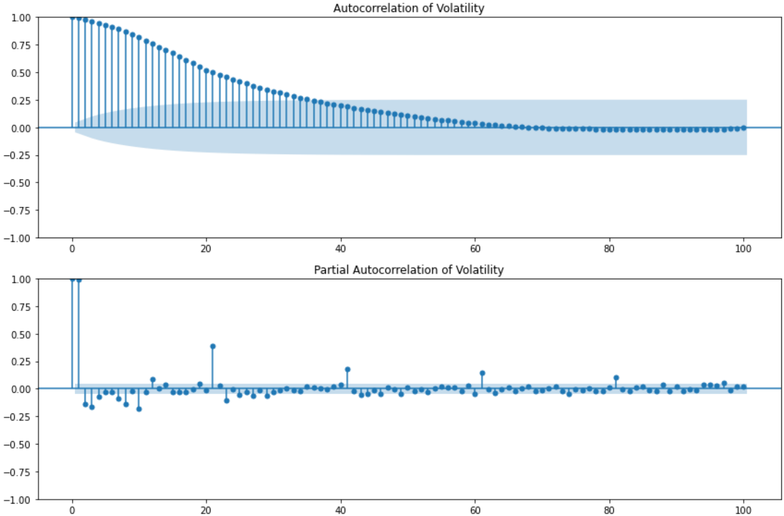
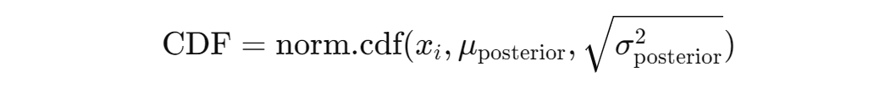

# AlphaQuantTrader

Welcome to the AlphaQuantTrader project! This powerful trading bot is designed to revolutionize the way you approach algorithmic trading by leveraging advanced machine learning techniques and Bayesian statistics.

## 1) What Exactly is AlphaQuantTrader?
AlphaQuantTrader is a sophisticated trading bot that utilizes reinforcement learning to automate and optimize stock trading decisions. It operates within a custom-built trading environment that simulates real-world market conditions, allowing the bot to make informed buy, hold, or sell decisions based on historical financial data. The bot is powered by a deep Q-network (DQN) model, which learns to maximize portfolio returns by continuously adapting to changing market conditions.

Additionally, AlphaQuantTrader incorporates Bayesian statistical methods to dynamically adjust risk and enhance decision-making, ensuring robust performance even in volatile markets.

## 2) Key Features

**2.1) Custom Trading Environment:**
AlphaQuantTrader is built on a custom Gym environment that accurately simulates trading activities, including transaction costs and portfolio management, offering a realistic trading experience.

**2.2) Deep Q-Network (DQN):**
At its core, the bot uses a DQN model to predict and execute the most profitable trading actions, learning from past market data to improve its strategies over time.

**2.3) Bayesian Risk Management:**
The bot integrates Bayesian updating techniques to adjust its risk management strategies dynamically, taking into account market volatility and uncertainty.

**2.4) Historical Data Processing:**
AlphaQuantTrader preprocesses historical market data, utilizing various technical indicators, statistical measures, and volatility analysis to inform its trading decisions.

**2.5) Portfolio Optimization:**
Through reinforcement learning, the bot continuously seeks to optimize its portfolio by balancing risk and reward, aiming to maximize long-term gains.

## 3) Why Use AlphaQuantTrader?

AlphaQuantTrader is ideal for traders and developers looking to automate and enhance their trading strategies with cutting-edge AI. Whether you're aiming to reduce the manual effort in trading or seeking a robust system that adapts to market changes, AlphaQuantTrader provides the tools and intelligence to help you stay ahead in the financial markets. With its combination of deep learning and Bayesian techniques, AlphaQuantTrader offers a strategic edge that goes beyond traditional trading algorithms.

# 4) Model Overview

Let's start by importimg the necessary libraries

```python
import yfinance as yf
import pandas as pd
import numpy as np
from scipy.stats import norm, skew, kurtosis
from sklearn.preprocessing import StandardScaler
import gym
import numpy as np
import pandas as pd
import random
from collections import namedtuple
import tensorflow as tf
from tensorflow.keras.models import Sequential
from tensorflow.keras.layers import LSTM, Dense, Dropout, ReLU, Input
from tensorflow.keras.regularizers import l2
import matplotlib.pyplot as plt
```
## 5) Preprocessing

The preprocessing phase is crucial for preparing raw financial data into a form suitable for training the reinforcement learning model. This step involves acquiring historical market data, cleaning it, and engineering the necessary features to ensure that the model receives meaningful input for effective learning.

**5.1) Data Acquisition**

Historical stock price data for the National Stock Exchange of India (^NSEI) index is downloaded using the `yfinance` library. The dataset spans a 14-year period, from January 1, 2010, to July 31, 2024, and provides the foundation for training and testing the reinforcement learning model.

```python
data = yf.download('^NSEI', start='2010-01-01', end='2024-07-31', interval='1d')
```
Here's a glimpse of the data we're working with. The first 10 rows of the data are as follows:
```
| Date       | Open         | High         | Low          | Close        | Adj Close   | Volume |
|------------|--------------|--------------|--------------|--------------|-------------|--------|
| 04-01-2010 | 5200.899902  | 5238.450195  | 5167.100098  | 5232.200195  | 5232.200195 | 0      |
| 05-01-2010 | 5277.149902  | 5288.350098  | 5242.399902  | 5277.899902  | 5277.899902 | 0      |
| 06-01-2010 | 5278.149902  | 5310.850098  | 5260.049805  | 5281.799805  | 5281.799805 | 0      |
| 07-01-2010 | 5281.799805  | 5302.549805  | 5244.75      | 5263.100098  | 5263.100098 | 0      |
| 08-01-2010 | 5264.25      | 5276.75      | 5234.700195  | 5244.75      | 5244.75     | 0      |
| 11-01-2010 | 5263.799805  | 5287.200195  | 5227.799805  | 5249.399902  | 5249.399902 | 0      |
| 12-01-2010 | 5251.100098  | 5300.5       | 5200.950195  | 5210.399902  | 5210.399902 | 0      |
| 13-01-2010 | 5212.600098  | 5239.200195  | 5169.549805  | 5233.950195  | 5233.950195 | 0      |
| 14-01-2010 | 5234.5       | 5272.850098  | 5232.5       | 5259.899902  | 5259.899902 | 0      |
| 15-01-2010 | 5259.899902  | 5279.850098  | 5242.450195  | 5252.200195  | 5252.200195 | 0      |
```
And the last 10 rows of the data are as follows:

```
| Date       | Open         | High         | Low          | Close        | Adj Close   | Volume |
|------------|--------------|--------------|--------------|--------------|-------------|--------|
| 16-07-2024 | 24615.90039  | 24661.25     | 24587.65039  | 24613        | 24613       | 283200 |
| 18-07-2024 | 24543.80078  | 24837.75     | 24504.44922  | 24800.84961  | 24800.84961 | 350900 |
| 19-07-2024 | 24853.80078  | 24854.80078  | 24508.15039  | 24530.90039  | 24530.90039 | 343800 |
| 22-07-2024 | 24445.75     | 24595.19922  | 24362.30078  | 24509.25     | 24509.25    | 324200 |
| 23-07-2024 | 24568.90039  | 24582.55078  | 24074.19922  | 24479.05078  | 24479.05078 | 436400 |
| 24-07-2024 | 24444.94922  | 24504.25     | 24307.25     | 24413.5      | 24413.5     | 366600 |
| 25-07-2024 | 24230.94922  | 24426.15039  | 24210.80078  | 24406.09961  | 24406.09961 | 391800 |
| 26-07-2024 | 24423.34961  | 24861.15039  | 24410.90039  | 24834.84961  | 24834.84961 | 383800 |
| 29-07-2024 | 24943.30078  | 24999.75     | 24774.59961  | 24836.09961  | 24836.09961 | 355000 |
| 30-07-2024 | 24839.40039  | 24971.75     | 24798.65039  | 24857.30078  | 24857.30078 | 385000 |
```
Note: The first 10 rows of the dataset have a volume value of 0 because no volume data was available when the data was downloaded. However, the volume column is not needed for the current analysis.

**Split the data based on the date**

```python
train_end_date = '2021-12-31'
val_end_date = '2022-12-31'
test_start_date = '2023-01-01'

# Split the data into training, validation, and test sets
training_data = data[data.index <= train_end_date].copy()
validation_data = data[(data.index > train_end_date) & (data.index <= val_end_date)].copy()
test_data = data[data.index >= test_start_date].copy()
```
This code segment divides the dataset into training, validation, and test sets. Specifically:
* Training Data: Data from the beginning of the dataset up to December 31, 2021, is used as the training data to build and train the model.
* Validation Data: Data from January 1, 2022, to December 31, 2022, is used as the validation data to tune the model's hyperparameters and prevent overfitting.
* Test Data: Data from January 1, 2023, onwards is reserved as test data to evaluate the model's performance on more recent, unseen data.

**Calculate daily returns on the training data**

```python
training_data['Daily Returns'] = training_data['Close'].pct_change()
```
To prepare the data for further analysis, daily returns are calculated on the training dataset. This is done by taking the percentage change in the closing prices, which helps in understanding the daily price movements.

```python
training_data_cleaned = training_data[['Adj Close', 'Daily Returns']].copy()
```
 The training data is then cleaned to retain only the adjusted closing prices and the newly calculated daily returns. These will be essential for the upcoming model calculations and derivations.

 **Volatility and Dynamic Window Size Calculation**

In this phase of the project, the aim is to calculate market volatility and adjust the analysis window size dynamically based on this volatility. These steps are crucial for capturing the changing market dynamics more accurately. To better understand market conditions, it's important to calculate how much prices fluctuate over time (volatility) and adjust the analysis window size accordingly. Below is the code that handles these calculations:

```python
def calculate_fixed_window_volatility(data, window_size=20):
    """Calculate rolling volatility with a fixed window size."""
    return data.rolling(window=window_size).std()

def determine_dynamic_window_size(volatility, min_window=5, max_window=20):
    """Determine dynamic window size based on volatility."""
    inverse_volatility = 1 / volatility.replace(0, np.nan)  # Handle zero volatility
    normalized_window_size = (inverse_volatility - inverse_volatility.min()) / (inverse_volatility.max() - inverse_volatility.min())
    dynamic_window_size = normalized_window_size * (max_window - min_window) + min_window
    return dynamic_window_size.fillna(min_window).astype(int)  # Fill NaNs and cast to int

training_data_cleaned['volatility'] = calculate_fixed_window_volatility(training_data_cleaned['Daily Returns'])

training_data_cleaned['dynamic_window_sizes'] = determine_dynamic_window_size(training_data_cleaned['volatility'])
```
This code block begins by calculating the rolling volatility of daily returns using the `calculate_fixed_window_volatility` function. The function takes the daily returns from training_data_cleaned and calculates how volatile the market has been over the last 20 days, storing the results in the volatility column.

Next, the `determine_dynamic_window_size` function adjusts the window size dynamically based on the calculated volatility. This adjustment ensures that when the market is more volatile, the analysis focuses on more recent data by using a smaller window size. The dynamically adjusted window sizes are then stored in the `dynamic_window_sizes` column of the training_data_cleaned DataFrame.

These calculations are crucial for ensuring that the model remains sensitive to market conditions, allowing it to adapt to changes in volatility over time.

**Autocorrelation Function (ACF) and Partial Autocorrelation Function (PACF)**

In this project, a fixed window size of 20 was chosen for calculating rolling volatility. This decision was informed by analyzing the Autocorrelation Function (ACF) and Partial Autocorrelation Function (PACF) plots of the volatility data.



The ACF plot shows the correlation between the volatility and its lagged values, while the PACF plot helps in understanding the direct relationship between volatility and its lags, excluding the influence of intermediate lags.

Upon examining these plots, it was observed that the significant correlations and patterns start to diminish around the 20th lag. This indicates that a 20-day window effectively captures the relevant historical volatility, making it a suitable choice for the fixed window size in this context.

This selection ensures that the model accounts for the most impactful recent volatility trends, without incorporating too much noise from older data.

**5.2) Bayesian Updating**

In this project, Bayesian updating is used to dynamically estimate the mean and standard deviation (SD) of the market returns as new data becomes available. This approach is particularly useful in calculating the Cumulative Distribution Function (CDF) of the returns, which is a key step in assessing the probability of different market outcomes. By continually refining the estimates of the mean and SD, the model can better understand the distribution of returns and make more informed decisions.

Why Use Bayesian Updating?
The Bayesian approach is chosen here to provide a systematic method for updating the model's estimates of the mean and standard deviation of the data. This is crucial because financial markets are highly dynamic, and new data constantly flows in. Bayesian updating allows the model to adjust its estimates in light of new information, leading to more accurate and adaptive predictions.

Specifically, the Bayesian method helps in calculating the mean (mu_posterior) and standard deviation (sigma_posterior) of the returns, which are essential inputs for calculating the CDF.

**The Bayesian Formulas Used**

The code starts by defining initial priors:

```python
mu_prior = 0  # Prior mean
sigma_prior_squared = 1  # Prior variance
alpha_prior = 3  # Prior alpha for Inverse-Gamma
beta_prior = 2  # Prior beta for Inverse-Gamma
```
These priors represent the model's initial assumptions about the market's behavior:

`mu_prior` is the prior mean, set to 0.
`sigma_prior_squared` is the prior variance, set to 1.

These initial values are crucial for the Bayesian formulas that follow.

The code then employs Bayesian formulas to update the posterior mean and variance, as well as to adjust the parameters of the Inverse-Gamma distribution, which models the uncertainty in volatility.

**Updating the Posterior Mean and Variance:**

The posterior mean (`mu_posterior`) and variance (`sigma_posterior_squared`) are updated using the following formulas:


where: 
* `x_i` represents the new daily return data point.
* `mu_prior` and `sigma_prior_squared` are the prior estimates for the mean and variance, respectively.
* `sigma_x_squared` is the variance of the observed data.
* These formulas update the mean and variance by combining prior knowledge with new observations, weighted by their respective variances

```python
def update_posterior(x_i, mu_prior, sigma_prior_squared, sigma_x_squared):
    """Update the posterior mean and variance."""
    if sigma_x_squared == 0:
        sigma_x_squared = 1e-6  # Assign a small value to sigma_x_squared
    mu_posterior = ((sigma_prior_squared * x_i) + (sigma_x_squared * mu_prior)) / (sigma_prior_squared + sigma_x_squared)
    sigma_posterior_squared = 1 / ((1 / sigma_prior_squared) + (1 / sigma_x_squared))
    return mu_posterior, sigma_posterior_squared
```

**Updating the Inverse-Gamma Distribution Parameters:**
    
The parameters of the Inverse-Gamma distribution, alpha_posterior and beta_posterior, are updated as follows:


where:
* `alpha_prior` and beta_prior are the initial parameters for the Inverse-Gamma distribution.
* These parameters are updated to reflect new evidence provided by each data point.
* The Inverse-Gamma distribution is a natural choice for modeling the uncertainty in variance, making it ideal for refining volatility estimates.

```python
  def update_inverse_gamma(x_i, mu_posterior, alpha_prior, beta_prior, sigma_posterior_squared):
    """Update the parameters of the Inverse-Gamma distribution."""
    if sigma_posterior_squared == 0:
        sigma_posterior_squared = 1e-6  # Assign a small value to sigma_posterior_squared
    alpha_posterior = alpha_prior + 0.5
    beta_posterior = beta_prior + (0.5 * ((x_i - mu_posterior) ** 2) / sigma_posterior_squared)
    return alpha_posterior, beta_posterior
```

**Iterative Bayesian Updating for Mean and Standard Deviation**

To dynamically update the model's understanding of market conditions, the code iteratively applies Bayesian updating to calculate the mean and standard deviation of daily returns as new data points are observed. This approach ensures that the model remains adaptive and accurately reflects the changing market environment.

```python
# Initialize lists with NaNs to match the length of f_training_data
updated_bayes_means = [np.nan] * len(f_training_data)
updated_bayes_sds = [np.nan] * len(f_training_data)
cdfs = [np.nan] * len(f_training_data)
```
First, three lists—`updated_bayes_means`, `updated_bayes_sds`, and `cdf`s—are initialized with NaN values. These lists are prepared to store the updated Bayesian means, standard deviations, and CDF values for each entry in f_training_data (after data cleaning and usual data handling processes). Initializing with NaN ensures that only valid calculations are stored, maintaining the integrity of the data throughout the process.

```python
for idx, row in f_training_data.iterrows():
    x_i = row['Daily Returns']
    window_size = int(row['dynamic_window_sizes'])
    
    # Check if there are enough data points behind the current data point to create a window
    if idx < window_size:
        continue

    # Calculate rolling variance using the dynamic window size
    rolling_variance = calculate_rolling_variance(f_training_data['Daily Returns'].iloc[idx - window_size:idx + 1], window_size).iloc[-1]

    if np.isnan(rolling_variance) or rolling_variance == 0:
        print(f"Skipping index {idx} due to invalid rolling variance")
        continue

    sigma_x_squared = rolling_variance

    # Update posterior mean and variance
    mu_posterior, sigma_posterior_squared = update_posterior(x_i, mu_prior, sigma_prior_squared, sigma_x_squared)

    # Update alpha and beta for the posterior Inverse-Gamma distribution
    alpha_posterior, beta_posterior = update_inverse_gamma(x_i, mu_posterior, alpha_prior, beta_prior, sigma_posterior_squared)

    # Store the updated mean and SD in the corresponding index
    updated_bayes_means[idx] = mu_posterior
    updated_bayes_sds[idx] = np.sqrt(sigma_posterior_squared)
```
The loop iterates through each row in f_training_data, which contains the normalized adjusted close prices and their corresponding daily returns. For each data point x_i, it checks if there is enough historical data available to create a valid rolling window, as determined by dynamic_window_sizes. If the index `idx` is less than the required window_size, the loop continues to the next iteration, ensuring that the calculations are based on a sufficient data history. For valid windows, the code calculates the rolling variance using a dynamically determined window size (window_size). This rolling variance is critical for understanding how much the returns deviate over the chosen period. If the calculated rolling_variance is invalid (i.e., NaN or zero), it indicates that the data may not be suitable for analysis, so the iteration is skipped to avoid inaccuracies. Once a valid rolling_variance is computed, it is stored as `sigma_x_squared`, which represents the observed data variance for the current window. The code then updates the posterior mean (mu_posterior) and posterior variance (sigma_posterior_squared) using the update_posterior function. These updates incorporate the new data point x_i into the model, refining its understanding of the mean and variance of the returns. The parameters (alpha_posterior and beta_posterior) of the Inverse-Gamma distribution are also updated using the update_inverse_gamma function. This step adjusts the model’s confidence in its volatility estimates, accounting for the new data.

Finally, the updated posterior mean and standard deviation are stored in the updated_bayes_means and updated_bayes_sds lists for each index idx. Storing the standard deviation as the square root of sigma_posterior_squared makes it easier to interpret.

**5.3) Calculating the Cumulative Distribution Function (CDF)**

After updating the mean and standard deviation using the Bayesian formulas, these updated values are used to calculate the CDF:



where:

* The CDF gives the probability that a return will be below a certain level, based on the updated mean and standard deviation.
* Calculating the CDF allows the model to evaluate the likelihood of different market outcomes, which is critical for making informed trading decisions.

```python
cdf = norm.cdf(x_i, mu_posterior, np.sqrt(sigma_posterior_squared))
cdfs[idx] = cdf
```
The `norm.cdf` function calculates the CDF of a normal distribution using the updated posterior mean (mu_posterior) and standard deviation (np.sqrt(sigma_posterior_squared)).
x_i is the current daily return data point for which we are computing the CDF. The calculated CDF value represents the probability that the daily return is less than or equal to x_i under the
updated normal distribution. This value is stored in the cdfs list at the current index idx. Storing the CDF allows the model to track the likelihood of different outcomes as it processes new data, which is crucial for making informed trading decisions.

**Setting the Posterior as the New Prior for the Next Iteration**

Once the CDF has been calculated and stored, the model prepares for the next iteration. The updated posterior values (mean, variance, and Inverse-Gamma parameters) are set as the new priors for the next data point:

```python
mu_prior, sigma_prior_squared, alpha_prior, beta_prior = mu_posterior, sigma_posterior_squared, alpha_posterior, beta_posterior
```
The updated posterior mean (mu_posterior) and variance (sigma_posterior_squared) replace the prior mean (mu_prior) and variance (sigma_prior_squared), respectively. Similarly, the updated parameters of the Inverse-Gamma distribution (alpha_posterior and beta_posterior) become the new priors (alpha_prior and beta_prior). This step is essential for Bayesian updating as it allows the model to incorporate the most recent information into its future estimates. By using the posterior values as the new priors, the model effectively "learns" from the latest data point and adjusts its predictions accordingly.

By calculating the CDF and updating the priors with the latest posterior values, the model continuously adapts to new data, maintaining an up-to-date and accurate understanding of market behavior. This iterative Bayesian process ensures that the model remains robust and responsive to changes, providing a dynamic framework for effective decision-making in a volatile market environment.

Lets print the first 10 rows of the final dataset: 

```
Date         | Adj Close   | Daily Returns  | volatility | dynamic_window_sizes | updated_bayes_means | updated_bayes_sds | CDF
------------------------------------------------------------------------------------------------------------------------------
13-02-2014   | 6001.10     | -0.01363       | 0.00769    | 10                   | -0.01363            | 0.00753           | 0.49996
14-02-2014   | 6048.35     | 0.00787        | 0.00787    | 10                   | -0.00348            | 0.00547           | 0.98106
18-02-2014   | 6127.10     | 0.01302        | 0.00833    | 10                   | 0.00088             | 0.00469           | 0.99517
19-02-2014   | 6152.75     | 0.00419        | 0.00840    | 10                   | 0.00176             | 0.00402           | 0.72676
20-02-2014   | 6091.45     | -0.00996       | 0.00852    | 10                   | -0.00015            | 0.00367           | 0.00379
21-02-2014   | 6155.45     | 0.01051        | 0.00895    | 9                    | 0.00123             | 0.00343           | 0.99659
24-02-2014   | 6186.10     | 0.00498        | 0.00867    | 9                    | 0.00175             | 0.00318           | 0.84477
25-02-2014   | 6200.05     | 0.00226        | 0.00725    | 11                   | 0.00183             | 0.00293           | 0.55789
26-02-2014   | 6238.80     | 0.00625        | 0.00734    | 11                   | 0.00248             | 0.00271           | 0.91803
```

# 6) Model Training

In this section, we move into the model training phase of our project, where we aim to develop a strategy for trading based on the financial data we have preprocessed. To achieve this, we use reinforcement learning (RL), a powerful machine learning approach that allows our model to learn from its own actions in a simulated environment. One of the most effective tools for developing RL models is the OpenAI Gym library. OpenAI Gym provides a collection of environments — computational representations of problems — that standardize how agents (our models) interact with these environments. This allows us to build, test, and compare various RL strategies effectively.

**6.1) What is an Environment in OpenAI Gym?**

In the context of reinforcement learning, an environment is essentially a problem that the agent (our trading model) tries to solve. It defines the state space (all possible situations the agent might encounter), the action space (all possible moves the agent can make), and the reward structure (how good or bad each action is, given the current state). The OpenAI Gym library provides a convenient framework for building these environments and includes many pre-built environments for classic RL problems like cart-pole balancing, playing video games, and more. However, since our problem is a custom financial trading scenario, we need to create a custom environment that reflects the dynamics of trading in a financial market.

**6.2) Creating a Custom Trading Environment**

To model our trading scenario, we define a custom environment class named TradingEnv by extending the gym.Env class from OpenAI Gym. This custom environment will simulate the process of trading a financial asset, allowing our RL model to interact with it by buying, holding, or selling based on the available data.

```python
class TradingEnv(gym.Env):
    def __init__(self, data, initial_balance=1000000, transaction_cost=0.0000135, max_num_timesteps = len(data) ):
        super(TradingEnv, self).__init__()

        self.data = data
        self.initial_balance = initial_balance
        self.transaction_cost = transaction_cost
        # Calculate max_num_timesteps dynamically based on the length of the data
        self.max_num_timesteps = max_num_timesteps

        self.balance = self.initial_balance
        self.stock_owned = 0
        self.current_step = 0
        self.current_position = None
        self.entry_price = None

        self.trading_history = []

        self.action_space = spaces.Discrete(3)

        self.observation_space = spaces.Box(
            low=0, high=np.inf, shape=(8,), dtype=np.float32)

    def reset(self):
        self.balance = self.initial_balance
        self.stock_owned = 0
      #  Calculate a random starting point with enough data left for max_num_timesteps
        self.current_step = np.random.randint(0, len(self.data) - self.max_num_timesteps + 1)
        self.current_position = None
        self.entry_price = None
        self.trading_history = []
        return normalize_state(self._get_observation())

    def step(self, action):
        if self.current_step >= len(self.data):
            raise ValueError("Current step exceeds the length of the data")
        
        if action not in [0, 1, 2]:
            raise ValueError("Invalid action")

        current_data = self.data.iloc[self.current_step]
        current_price = current_data['Adj Close']
        reward = 0
    
        if action == 2:  # Buy
            if self.current_position is None or self.current_position == 'sell':
                self.current_position = 'buy'
                self.entry_price = current_price
                shares_to_buy = (self.balance * 0.15) / (current_price * (1 + self.transaction_cost))
                self.stock_owned += shares_to_buy
                self.balance -= shares_to_buy * current_price * (1 + self.transaction_cost)
                reward = 0
            else:
                self.current_position = 'hold'
                previous_price = self.data.iloc[self.current_step - 1]['Adj Close']
                reward = current_price - previous_price
    
        elif action == 1:  # Hold
            if self.current_position == 'buy' or self.current_position == 'hold':
                previous_price = self.data.iloc[self.current_step - 1]['Adj Close']
                reward = current_price - previous_price
    
        elif action == 0:  # Sell
            if self.current_position == 'buy' or self.current_position == 'hold':
                reward = current_price - self.entry_price
                self.balance += self.stock_owned * current_price * (1 - self.transaction_cost)
                self.stock_owned = 0
                self.entry_price = None
                self.current_position = 'sell'
            else:
                reward = -0.5
                
        
        # Use the precomputed Bayesian standard deviation
        bayes_std = self.data['updated_bayes_sds'].iloc[self.current_step]

        # Avoid division by zero and apply scaling factor
        scaling_factor = 0.005  # scaling factor
        if bayes_std == 0 or np.isnan(bayes_std):
            risk_adjusted_reward = reward
        else:
            risk_adjusted_reward = (reward / (bayes_std + 1e-6)) * scaling_factor

        
        self.current_step += 1
        done = self.current_step >= len(self.data) - 1
        if done:
            self.balance += self.stock_owned * current_price * (1 - self.transaction_cost)
            self.stock_owned = 0

        portfolio_value = self.balance + self.stock_owned * current_price

        self.trading_history.append({
            'step': self.current_step,
            'current_price': current_price,
            'balance': self.balance,
            'portfolio_value': portfolio_value
        })
        
        # Return the raw state, normalization will be done outside this method
        raw_state = self._get_observation()

        return raw_state, risk_adjusted_reward, done, {"portfolio_value": portfolio_value}

    def _get_observation(self):
        if self.current_step >= len(self.data):
            raise ValueError("Current step exceeds the length of the data")
        
        current_data = self.data.iloc[self.current_step]
        return np.array([
            self.balance,
            self.stock_owned,
            current_data['Adj Close'],
            current_data['Daily Returns'],
            current_data['volatility'],
            current_data['updated_bayes_means'],
            current_data['updated_bayes_sds'],
            current_data['CDF']
        ], dtype=np.float32)

    def render(self, mode='human', close=False):
        if close:
            plt.close()
            return

        df = pd.DataFrame(self.trading_history)
        df.set_index('step', inplace=True)

        fig, ax = plt.subplots(3, 1, figsize=(12, 10), sharex=True)

        ax[0].plot(df.index, df['current_price'], label='Price')
        ax[0].set_ylabel('Price')
        ax[0].legend()

        ax[1].plot(df.index, df['balance'], label='Balance')
        ax[1].set_ylabel('Balance')
        ax[1].legend()

        ax[2].plot(df.index, df['portfolio_value'], label='Portfolio Value')
        ax[2].set_ylabel('Portfolio Value')
        ax[2].set_xlabel('Step')
        ax[2].legend()

        plt.show()
```

**Initialization (__init__ method): This sets up the initial conditions of our trading environment:**

* The initial balance is set to $1,000,000.
* The transaction cost per trade is set to 0.0000135, which is typical for financial markets.
* We define the maximum number of timesteps based on the length of the input data, setting a limit on how many steps the model can take in one episode.
* Other variables like `balance`, `stock_owned`, `current_step`, `current_position`, `entry_price`, `trading_history`, `action_space`, and `observation_space` are initialized to track the agent's state.

**Action and Observation Space:**

* Action Space: Defined using `spaces.Discrete(3)`, representing three possible actions: `0` (Sell), `1` (Hold), and `2` (Buy).
* Observation Space: Defined using `spaces.Box`, representing the financial state of the agent, including `balance, number of stocks owned, and various financial indicators (like adjusted close price, daily returns, volatility, Bayesian updated mean, standard deviation, and CDF).

**Reset Method:** Resets the environment to its initial state, allowing the model to start fresh from a random point in the data, ensuring a diverse learning experience.

**Step Method:**

* Implements the core logic of the trading strategy. Depending on the chosen action (Buy, Hold, Sell), the method updates the balance, stock holdings, and calculates the reward.
* Uses precomputed Bayesian standard deviation to adjust the reward based on risk, encouraging the agent to prefer less risky trades.
* Tracks the trading history for later analysis and visualization.

**Observation Method (`_get_observation`):** Provides the current state of the environment as a NumPy array, capturing essential details required for decision-making by the RL agent.

 **Render Method:** Provides visualization for the trading performance over time, plotting price, balance, and portfolio value, which is useful for debugging and understanding the agent’s decisions

**6.3) Predefined Strategy**

To kickstart our reinforcement learning model, we've developed a strategy to pre-populate the memory buffer with meaningful experiences. This strategy allows the model to start learning from a more informed baseline, rather than from completely random actions.

```python
def predefined_strategy(env, num_steps):
    previous_cdf = None
    current_position = None  # can be 'buy', 'hold', or 'sell'
    entry_price = None  # price at which the asset was bought
    balance = env.initial_balance
    stock_owned = 0
    transaction_cost = env.transaction_cost
    trading_results = []

    for index in range(num_steps):
        row = env.data.iloc[index]
        current_cdf = row['CDF']
        current_price = row['Adj Close']
        reward = 0
        action = None

        if previous_cdf is None:
            previous_cdf = current_cdf
            trading_results.append((None, 0, balance, stock_owned))
            continue

        if current_cdf > previous_cdf:
            if current_position is None or current_position == 'sell':
                current_position = 'buy'
                entry_price = current_price
                shares_to_buy = (balance * 0.15) / (current_price * (1 + transaction_cost))
                stock_owned += shares_to_buy
                balance -= shares_to_buy * current_price * (1 + transaction_cost)
                action = 2  # Buy
            else:
                current_position = 'hold'
                action = 1  # Hold
                if index > 0:
                    previous_price = env.data.iloc[index - 1]['Adj Close']
                    reward = current_price - previous_price
        elif current_cdf == previous_cdf:
            if current_position == 'buy' or current_position == 'hold':
                current_position = 'hold'
                action = 1  # Hold
                if index > 0:
                    previous_price = env.data.iloc[index - 1]['Adj Close']
                    reward = current_price - previous_price
        else:  # current_cdf < previous_cdf
            if current_position == 'buy' or current_position == 'hold':
                current_position = 'sell'
                action = 0  # Sell
                reward = current_price - entry_price
                balance += stock_owned * current_price * (1 - transaction_cost)
                stock_owned = 0
                entry_price = None
            else:
                current_position = None
                action = 0  # Sell
                reward = -0.5

        if current_position is None:
            reward = -0.5
       
        previous_cdf = current_cdf
     
        trading_results.append((action, reward, balance, stock_owned))

    if current_position == 'buy' or current_position == 'hold':
        balance += stock_owned * current_price * (1 - transaction_cost)
        stock_owned = 0

    return trading_results

def normalize_state(state):
    state_df = pd.DataFrame([state], columns=feature_names)
    print(f"State shape before normalization: {state_df.shape}")
    normalized_state = scaler.transform(state_df)
    print(f"State shape after normalization: {normalized_state.shape}")
    return normalized_state.flatten()

def store_experience(memory_buffer, experience):
    memory_buffer.append(experience)

def generate_initial_experiences(env, memory_buffer, num_steps):
    state = env.reset()
    state = normalize_state(state)
    state = state.reshape(1, state_size, 1)

    trading_results = predefined_strategy(env, num_steps)

    for index, (action, reward, balance, stock_owned) in enumerate(trading_results):
      
        if action is None or action not in [0, 1, 2]:
           # print(f"Invalid action at index {index}: {action}")
            continue  # Skip this step if action is invalid
        next_state, _, _, _ = env.step(action)
        next_state = normalize_state(next_state)
        next_state = next_state.reshape(1, state_size, 1)

        done = (index == len(trading_results) - 1)
        exp = experience(state, action, reward, next_state, done)
        store_experience(memory_buffer, exp)

        state = next_state

def setup_timesteps(num_episodes, dataset_size, min_percentage, max_percentage):
    min_timesteps = int(dataset_size * min_percentage)
    max_timesteps = int(dataset_size * max_percentage)
    
    timesteps_per_episode = []
    for _ in range(num_episodes):
        timesteps = random.randint(min_timesteps, max_timesteps)
        timesteps_per_episode.append(timesteps)
    return timesteps_per_episode

num_episodes = 600  # Number of episodes
dataset_size = len(data)  # Size of the dataset
min_percentage = 0.30 # Minimum percentage of the dataset size (30%)
max_percentage = 0.40  # Maximum percentage of the dataset size (40%)
num_timesteps = setup_timesteps(num_episodes, dataset_size, min_percentage, max_percentage)

memory_buffer = deque(maxlen=100000)  # Set replay buffer size to 100000
  
initial_population_size = 20000 
current_population = 0

for episode_timesteps in num_timesteps:
    if current_population >= initial_population_size:
        break
    generate_initial_experiences(env, memory_buffer, episode_timesteps)
    current_population = len(memory_buffer)
```
The function `predefined_strategy(env, num_steps)` is designed to generate a sequence of trading actions based on simple logic involving the cumulative distribution function (CDF) of price movements. The goal of this function is to simulate a trading agent that interacts with the environment and fills up the memory buffer with initial experiences.

The predefined_strategy function outputs a list of trading results that contains the actions taken and the corresponding rewards.

**State Normalization Function:**

The `normalize_state(state)` function is a utility that normalizes the state using a pre-fitted scaler. This is crucial because machine learning models perform better with normalized input data.

* Normalization Process: The input state is first converted to a DataFrame. The scaler, assumed to be pre-fitted on the training data, transforms the state features to a normalized scale. This normalized state is then flattened to be used as input for the model.

**Experience Storage Function:**

The `store_experience(memory_buffer, experience)` function adds an experience to the memory buffer.

* Experience Replay: In reinforcement learning, experiences consist of state transitions and are used to train the model. The memory_buffer is a deque object that stores these experiences up to a certain capacity (100,000 in this case).

**Generate Initial Experiences Function:**

The `generate_initial_experiences(env, memory_buffer, num_steps)` function fills the memory buffer with initial trading experiences.

* It resets the environment and obtains the initial state.
* The `predefined_strategy` function is used to generate a series of predefined trading actions and results.
* For each trading result, it steps through the environment, normalizes the next state, and stores the experience in the memory buffer.

**Timesteps Setup Function**

The `setup_timesteps(num_episodes, dataset_size, min_percentage, max_percentage)` function calculates random numbers of timesteps for each episode.

* It generates a list of random timesteps for each episode based on a percentage range of the dataset size.
* This randomness helps in creating varied lengths of experiences, making training more robust

**Main Loop for Initial Experience Population**

This code block initializes the memory buffer with initial experiences:

* It sets up parameters such as the number of episodes and dataset size.
* It initializes a memory buffer to store up to 100,000 experiences.
* A loop iterates to populate the buffer with experiences generated from the predefined strategy until it reaches a specified size (20,000).

Overall, this setup prepares the trading agent by providing a diverse set of initial experiences, which are crucial for effective reinforcement learning before starting the actual training process.


